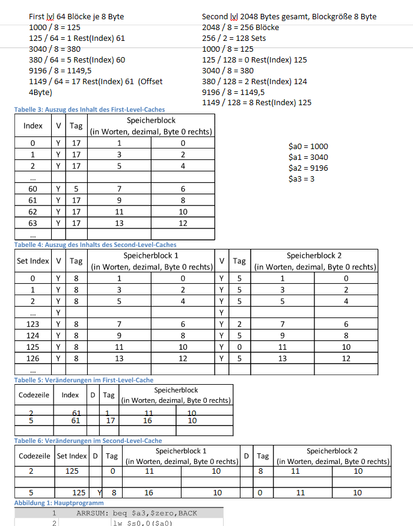

# Theorieübung – Cache

Christopher Jäger und Tobias Stöhr

## 5

### 5.1 Direct Mapped Cache

**Cache Level 1**
$$
\frac{2404}{16} = 150\ R4\\
\frac{150}{32} \approx 4\\
\frac{150}{32} = 4\ R22\\
$$
**Cache Level 2**
$$
\frac{2404}{16} = 150\ R4\\
\frac{150}{1024} = 0\ R150\\
\frac{4}{4} = 1 \rightarrow 50
$$

| Cache Lvl | Index       | Tag       | Daten  |
| --------- | ----------- | --------- | ------ |
| 1         | $22 = 22$   | $4 \ne 1$ |        |
| 2         | $150 = 150$ | $0 = 0$   | **50** |

### 5.2 Direct-Mapped-Cache und Set-Associative Cache

#### 5.2.1

### 5.2.2

[Aufgabe_5_2_2.xlsx](Aufgabe_5_2_2.xlsx) 