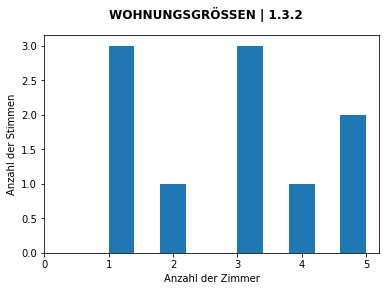
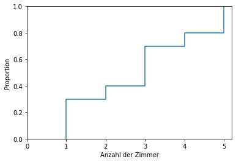

# Sto - Hausaufgabe 01

## 1.1 EIGENSCHAFTEN VON MERKMALEN

Geben Sie für jedes Merkmal an, ob es **quantitativ diskret**, **quantitativ stetig**, **qualitativ ordinal** oder **qualitativ nominal** ist.

| #    | Frage                                                     | Lösung              |
| ---- | --------------------------------------------------------- | ------------------- |
| a    | Anzahl der Insassen in einem PKW bei der Verkehrszählung: | quantitativ diskret |
| b    | Reisegeschwindigkeit eines Flugzeugen                     | quantitativ stetig  |
| c    | Schultypen                                                | qualitativ nominal  |
| d    | Temperaturangaben in °C                                   | quantitativ stetig  |
| e    | Zugriffszeiten auf die Daten einer Festplatte             | quantitativ diskret |
| f    | Fassungsvermögen eines Binnenschiffs                      | quantitativ diskret |
| g    | Energieeffizienz von Elektrogeräten                       | qualitativ ordinal  |
| h    | Ölverbrauch eines Einfamilienhauses pro Jahr              | quantitativ diskret |
| i    | Anzahl von Likes eines Instagram-Posts                    | quantitativ diskret |
| j    | Nationalität von Studierenden                             | qualitativ nominal  |
| k    | Intelligenzquotient                                       | quantitativ diskret |
| l    | Wohnort von Studierenden                                  | qualitativ nominal  |

## 1.3 WOHNUNGSGRÖSSEN

10 Personen aus Konstanz wurden nach der Anzahl der Zimmer in ihrer Wohnung gefragt. Es ergab sich
folgende Urliste:
3, 4, 5, 1, 5, 2, 1, 3, 1, 3 

1, 1, 1, 2, 3, 3, 3, 4, 5, 5

### 1.3.1 Geben Sie die relative und absolute Häufigkeiten der genannten Zimmeranzahlen an.

gesamt Anzahl = 10
$$
\frac{absolute\ Häufigkeit}{gesamt\ Anzahl}=relative\ Häufigkeit
$$


| #      | absolute " | realtive "                 |
| ------ | ---------- | -------------------------- |
| 1      | 3          | (3 / 10) = **0,3** = 30%   |
| 2      | 1          | (1 / 10) = **0,1** = 10%   |
| 3      | 3          | (3 / 10) = **0,3** = 30%   |
| 4      | 1          | (1 / 10) = **0,1** = 10%   |
| 5      | 2          | (2 / 10) = **0,2** = 20%   |
| =*SUM* | = *10*     | = *(10 / 10) = 1,0 = 100%* |

### 1.3.2 Zeichnen Sie ein Histogramm für die absoluten Häufigkeiten

```python
# Python Script für 1.3.2
import matplotlib.pyplot as plt
import numpy as np

fig, ax = plt.subplots()

urliste_1 = [3,4,5,1,5,2,1,3,1,3]

plt.hist(urliste_1)
ax.set_xticks(np.arange(0, 6))
fig.suptitle('WOHNUNGSGRÖSSEN | 1.3.2', fontweight ="bold")

plt.xlabel("Anzahl der Zimmer")
plt.ylabel("Anzahl der Stimmen")
plt.show()
```



### 1.3.3 Zeichnen Sie ein Diagramm für die empirische Verteilungsfunktion

```python
# Python Script für 1.3.3
import matplotlib.pyplot as plt
import numpy as np
import seaborn as sns

fig, ax = plt.subplots()

urliste_1 = [3,4,5,1,5,2,1,3,1,3]

sns.ecdfplot(data=urliste_1)
ax.set_xticks(np.arange(0, 6))

plt.xlabel("Anzahl der Zimmer")
plt.ylabel("Proportion")
plt.show()
```



### 1.3.4 Geben Sie an, wie viele Prozent der Befragten

```python
# Python Script für Aufgabe 1.3.4 (a und b)
urliste_1 = [3,4,5,1,5,2,1,3,1,3]
under_4 = 0
b_24 = 0
summ = 0
for x in urliste_1:
    if x < 5: # maximal 4 Zimmer
        under_4 += 1
        if 1 < x: # minimal 2 Zimmer
            b_24 += 1
    summ += 1
a = under_4 / summ
b = b_24 / summ
print("a=", under_4, "/", summ, "=", a, "=", a * 100, "%")
print("b=", b_24, "/", summ, "=", b, "=", b * 100, "%")
```

#### a) maximal 4 Zimmer zur Verfügung haben.
count(maximal 4) = 8 Stk
$$
\frac{8}{10} = 0.8 = 80\%
$$

#### b) mindestens 2 und maximal 4 Zimmer zur Verfügung haben
count(min. 2 und max. 4) = 5 Stk
$$
\frac{5}{10} = 0.5 = 50\%
$$


