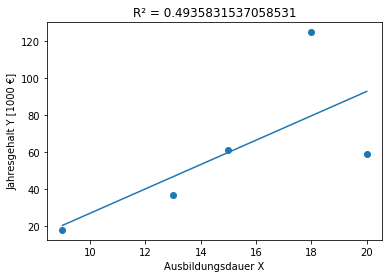

# Hausaufgabe 2

## Disclaimer

Viele Methoden / Funktionen die in den Python-Scripts verwendet werden sind selbst geschrieben und sind [hier definiert (Python Methoden Funktionen)](#Python Methoden Funktionen)

## 1.5 An der Fahrradbrücke

> Alice steht an der Konstanzer Fahrradbrücke und zählt die Anzahl der Räder der Fahrzeuge (Einräder,
> Fahrräder, Dreiräder, Kinderwagen, . . . ) welche an ihr vorbei rollen.
>Ihre Beobachtungen resultieren in folgender Urliste:

` 2, 4, 3, 1, 2, 4, 2, 2, 2, 3. `

> Berechnen Sie für die Beobachtungen von Alice:

\# | Aufgabe                  | Lösung
---|--------------------------|-------
a) | das arithmetische Mittel | 2,5
b) | den Median               | 2,0
c) | den Modalwert            | 2
d) | das 10%-Quantil          | 1
e) | das 25%-Quantil          | 2
f) | das 75%-Quantil          | 3
g) | den Interquartilabstand  | 1
h) | die Spannweite           | 3

> Geben Sie jeweils an, wie Sie die geforderten Charakteristika berechnet haben!
> => Alles wurde mit Python berechnet

```python
# Aufgabe 1.5

ur_liste = [2, 4, 3, 1, 2, 4, 2, 2, 2, 3]
ur_liste.sort()

# das arithmetische Mittel
print("a) das arithmetische Mittel = ", get_arithmetic_mean(ur_liste))

# den Median
print("b) den Median = ", statistics.median(ur_liste))

# den Modalwert
print("c) den Modalwert = ", get_mode(ur_liste))

# das 10%-Quantil
print("d) das 10%-Quantil = ", get_quantile(ur_liste, .10))

# das 25%-Quantil
print("e) das 25%-Quantil = ", get_quantile(ur_liste, .25))

# das 75%-Quantil
print("f) das 75%-Quantil = ", get_quantile(ur_liste, .75))

# den Interquartilabstand
print("g) den Interquartilabstand = ", get_interquartile_range(ur_liste))

# die Spannweite
print("h) die Spannweite = ", get_span(ur_liste))

"""OUTPUT
a) das arithmetische Mittel =  2.5
b) den Median =  2.0
c) den Modalwert =  [2]
d) das 10%-Quantil =  1
e) das 25%-Quantil =  2
f) das 75%-Quantil =  3
g) den Interquartilabstand =  1
h) die Spannweite =  3
"""
```

## 1.6

> Frank schreibt für seine Schülerzeitung einen Artikel zum Thema
> „Taschengeld eines Achtklässlers“. Hierfür
> befragt er 6 zufällig ausgewählte Schüler der Klasse 8a nach ihrem
> monatlichen Taschengeld in Euro. Seine
> Umfrage ergibt die folgende Urliste:

` 25, 10, 30, 25, 35, 25 `

### 1.6.1

> Berechnen Sie für Frank’s Urliste folgende Größen. Stellen Sie Ihren Rechenweg nachvollziehbar dar!

\# | Aufgabe                       | Lösung
---|-------------------------------|------------------
a) | Arithmetisches Mittel         | 25.0
b) | Median                        | 25.0
c) | 75%-Quantil                   | 30
d) | empirische Standardabweichung | 8.366600265340756

```python
# Aufgabe 1.6.1

ur_liste = [25, 10, 30, 25, 35, 25]
ur_liste.sort()
print(ur_liste)

print("a) Arithmetisches Mittel = ", get_arithmetic_mean(ur_liste))
print("b) Median = ", statistics.median(ur_liste))
print("c) 75%-Quantil = ", get_quantile(ur_liste, .75))
print("d) empirische Standardabweichung = ", get_empirical_std(ur_liste))

"""OUTPUT
[10, 25, 25, 25, 30, 35]
a) Arithmetisches Mittel =  25.0
b) Median =  25.0
c) 75%-Quantil =  30
d) empirische Standardabweichung =  8.366600265340756
"""
```

### 1.6.2

> Beantworten Sie folgende Fragen möglichst allgemeinverständlich!

#### 1.6.2.a

> Frank berechnet außerdem noch die Spannweite seiner Stichprobe zu R =5 und den Interquartilabstand zu I =25. Machen diese Berechnungen Sinn? Begründen Sie Ihre Meinung!

Nein diese Berechnungen machen kein Sinn, da die Berechnungen vertauscht wurden und die Lösungen für das jeweilige andere ist.

```python
# Aufgabe 1.6.2

print("a) ")
print("R = ", get_span(ur_liste))
print("I = ", get_interquartile_range(ur_liste))

"""OUTPUT
a) 
R =  25
I =  5
"""
```

#### 1.6.2.b

> Mittelwert und Median von Franks Daten sind gleich. Ist das immer so, oder ist das Zufall?

Das ist Zufall, da der Mittelwert berechnet und der Median selektiert wird.

#### 1.6.2.c

> Was hat der Wert des 75%-Quantils zu bedeuten? Fassen Sie Ihr Ergebnis in Worte.

- 75% der Menge ist der Wert **maximal** des Quantils
- 25% der Menge ist der Wert **minimal**  des Quantils

#### 1.6.2.d

> Frank führt seine Umfragen nach dem monatlichen Taschengeld noch in zwei anderen Klassen, den
> Klassen 8b und 8c, durch. In beiden Fällen erhält er das selbe arithmetische Mittel wie bei Klasse
> 8a. Im Fall von Klasse 8b erhält er allerdings eine Standardabweichung von 0, im Fall von Klasse 8c
> erhält er eine Standardabweichung, die deutlich größer ist als die der Klasse 8a. Was schließen Sie
> hieraus hinsichtlich der Stichproben des monatlichen Taschengelds aus den anderen beiden Klassen?

Wenn das arithmetische Mittel gleich bleibt und die Standardabweichung sich erhöht, dann haben die Kinder im Durchschnitt eine höhere Abweichung zum Mittelwert (Beispiel: 8b = {30, 30}, 8c = {20, 40}, beide haben das gleiche arithmetische Mittel)

1.6.2.e

> Frank interessiert sich weiterhin für die Schuhgröße der Befragungsteilnehmer, sowie für ihre
> Mathenote. Er berechnet hierfür die Korrelationskoeffizienten von Schuhgröße und Taschengeld zu
> r(S,T) = 0.875 und von Mathenote und Taschengeld zu r(M ,T) = −0.038. Was schließen Sie hieraus
> über den Zusammenhang der betrachteten Größen?

Zwischen Mathenote und Taschengeld ist ein vernachlässigbarer Wert,
trotzdem sagt der Wert etwas aus:
Je besser man in Mathe ist, desto weniger Taschengeld verdient man.

Die Korrelation zwischen Schuhgrößen und die Menge an Taschengeld ist sehr groß. Je größer die Schuhe, desto mehr Taschengeld bekommt man. Ferner ist dabei zu beachten, dass die Schuhgröße auch stark vom Alter abhängt.

#### 1.6.2.f

> Grace befragt 3 Schüler nach ihrem Taschengeld und berechnet den arithmetische Mittelwert dieser
> Stichprobe zu 300 €. Beschreibt diese Zahl die Stichprobe ausreichend gut, oder sollte sie besser
> noch andere Werte berechnen?

Bei 3 Schülern ist die Datenmenge zu gering für einen arithmetischen Mittelwert, es könnte sein, dass einer sehr viel Geld bekommt, der andere bischen weniger und der letzte garnichts.
Grace sollte am besten noch den Median und den Modalwert bestimmen und das 75%-Quantil.

Am besten befragt Grace mehr Schüler, um einen bessere Stichprobe zu bekommen.

## 1.9

### 1.9.1

> Bei welcher der dargestellten Punktwolken (A), (B) oder (C) erhält man als Korrelationskoeffizienten
r(x, y) = −0, 966? Begründen Sie Ihre Meinung und nennen Sie für die beiden anderen Punktwolken jeweils
einen Ablehnungsgrund.

` Bild A Werte = -1, 0, 0, 0.5, 1, 1.5 `

` Bild B Werte = 0.5, 0, 0, -1, -1, -1.5 `

` Bild C Werte = 1, -0.4, -0.3, 0.3, -2.1, -1.6 `

Bild | r(x, y) = −0, 966? | Begründung                                                               | berechneter Wert
-----|--------------------|--------------------------------------------------------------------------|-----------------
A    | Nein               | Punkte verlaufen in gleichermaßen in eine positive Richtung | r(x, y) ≈ 0.977
B    | **Ja**          | Punkte verlaufen gleichmäßig in eine negative Richtung                   | r(x, y) ≈ -0.966
C    | Nein               | Die Punkte verlaufen relativ gerade zur x-Achse, nur die zwei letzten Werte haben eine starke abweichung | r(x, y) ≈ -0.808

```python
import matplotlib.pyplot as plt

x_ax = range(1, 7)

a_bild = [-1, 0, 0, 0.5, 1, 1.5]
b_bild = [0.5, 0, 0, -1, -1, -1.5]
c_bild = [1, -0.4, -0.3, 0.3, -2.1, -1.6]

# import numpy as np
a = np.corrcoef(a_bild, x_ax)
b = np.corrcoef(b_bild, x_ax)
c = np.corrcoef(c_bild, x_ax)

print("Bild A = ", a[0][1])
print("Bild B = ", b[0][1])
print("Bild C = ", c[0][1])

""" OUTPUT
Bild A =  0.9767483130677757
Bild B =  -0.966091783079296
Bild C =  -0.8075728530872481
"""
```

### 1.9.2

> Wählen Sie für jede der dargestellten Punktwolken aus den folgenden Werten denjenigen aus, der am
> besten für den Korrelationskoeffizienten passt. Achtung: Nicht alle Werte passen zu einem Bild.

` −0.92 0.00 0.69 −0.08 −0.64 −0.20 0.33 1.00 −1.00 0.98 `

Sortiert:

` -1.00 -0.92 -0.64 -0.20 -0.08 0.00 0.33 0.69 0.98 1.00 `

\#  | geschäzter R Wert
--- | -----------------
A   | 0.33
B   | 0.69
C   | 0.98
D   | 1.00
E   | -0.08
F   | -0.64 
G   | -0.92
H   | -1.00

## 1.12

> Fünf Mitglieder eines Sportclubs gehen der Frage nach, ob zwischen ihrer Schul- und Ausbildungszeit und
> ihrem Jahreseinkommen ein statistischer Zusammenhang besteht. Das Ergebnis der anonymen Befragung
> ist in folgender Tabelle wiedergegeben.

Ausbildungsdauer X | Jahresgehalt Y [in 1000€]
-------------------|-----------------------
9                  | 18 k
13                 | 37 k
15                 | 61 k
18                 | 125 k
20                 | 59 k

### 1.12.a

> Berechnen Sie den empirischen Korrelationskoeffizient der beiden untersuchten Merkmale. Interpretieren Sie diesen Wert!

(empirischen) Korrelationskoeffizient:
$$
{\displaystyle r_{x,y}={\frac {\sum _{i=1}^{n}(x_{i}-{\overline {x}})(y_{i}-{\overline {y}})}{\sqrt {\sum _{i=1}^{n}(x_{i}-{\overline {x}})^{2}\sum _{i=1}^{n}(y_{i}-{\overline {y}})^{2}}}}={\frac {SP_{x,y}}{\sqrt {SQ_{x}SQ_{y}}}}}\approx0.7026
$$
Der Korrelationskoeffizient sagt mit diesem Wert aus, dass die Ausbildungszeit und das Jahreseinkommen eine relativ mittelmäßig starke Korrelation haben. Also je länger die Ausbildungszeit geht, desto mehr Jahreseinkommen habe ich. 

```python
# 1.12

# 1.12.a
def get_empirical_corrcoef(ax_x, ax_y):
    n = len(ax_x)
    if n > len(ax_y):
        return -1

    n = range(0, n)

    __x = get_arithmetic_mean(ax_x)
    __y = get_arithmetic_mean(ax_y)
    
    sp_xy = 0 # 
    sq_x = 0
    sq_y = 0
    for i in n:
        xi_ = ax_x[i] - __x
        yi_ = ax_y[i] - __y
        # SP(x, y)
        sp_xy += xi_ * yi_
        # SQ(x)
        sq_x += xi_**2
        # SQ(y)
        sq_y += yi_**2
    
    r_xy = sp_xy / math.sqrt(sq_x * sq_y)

    return r_xy

# Ausbildungsdauer X
dauerX = [9, 13, 15, 18, 20]
# Jahresgehalt Y [1000 €]
gehaltY = [18, 37, 61, 125, 59]

fig, ax = plt.subplots()
ax.scatter(dauerX, gehaltY)
ax.set_title("Aufgabe 1.12")
ax.set_xlabel("Ausbildungsdauer X")
ax.set_ylabel("Jahresgehalt Y [in 1000 €]")

ecc = get_empirical_corrcoef(dauerX, gehaltY)

ax.plot()
print("corrcoef =", ecc)

"""OUTPUT
corrcoef = 0.7025547336014847
"""
```

### 1.12.b

> Bestimmen Sie eine lineare Regressionsfunktion und zeichnen Sie diese. Bewerten Sie die Passgenauigkeit dieser Regressionsgerade optisch und durch das Bestimmtheitsmaß.

**arithmetische Mittelwerte:**
$$
\overline{x}=\frac{1}{n}\sum_{i=1}^n(x_i)
\newline
\overline{y}=\frac{1}{n}\sum_{i=1}^n(y_i)
$$
**(empirischen) Standardabweichungen:**
$$
s_x = \sqrt{\frac{1}{n-1}\sum_{i=1}^{n}(x_i-\overline{x})^2}\approx4.3012\newline
s_y = \sqrt{\frac{1}{n-1}\sum_{i=1}^{n}(y_i-\overline{y})^2}\approx40.3733
$$
**empirische Kovarianz:**
$$
s_{x,y}=\frac{1}{n-1}\sum_{i=1}^n(x_i-\overline{x})(y_i-\overline{y})=122
$$
**empirischer Korrelationskoeffizient:**
$$
r_{x,y} = \frac{s_{x,y}}{s_x s_y}\approx0.7026
$$
**Bestimmtheitsmaß:**
$$
r^2_{x,y}\approx0.4936
$$
**Diagramm und Bewertung:**

Die Passgenauigkeit der Regressionsgerade sieht im Bild relativ gut aus. Nur die zwei letzten Punkte weichen stark davon ab. Mit dieser Annahme beschreibt die Gerade, den Zusammenhang zwischen Jahreseinkommen und Ausbildungszeit gut.

Laut dem Bestimmtheitsmaß beschreibt die Gerade, den Zusammenhang zwischen Ausbildungsdauer und Jahresgehalt mittelmäßig und ist somit nicht Aussagekräftig.



```python
# Aufgabe 1.12.b

# Ausbildungsdauer X
dauerX = [9, 13, 15, 18, 20]
# Jahresgehalt Y [1000 €]
gehaltY = [18, 37, 61, 125, 59]

__x = get_arithmetic_mean(dauerX)
__y = get_arithmetic_mean(gehaltY) 

# k = s_xy / (s_x**2)
n = len(dauerX)
s_xy = 0
s_x = 0
s_y = 0
for i in range(0, n):
    __xi = (dauerX[i] - __x) 
    __yi = (gehaltY[i] - __y) 
    s_xy += __xi * __yi
    s_x += __xi ** 2
    s_y += __yi ** 2

n_1 = 1 / (n - 1)
s_xy = s_xy * n_1
s_x = math.sqrt(n_1 * s_x)
s_y = math.sqrt(n_1 * s_y)
k = s_xy / (s_x ** 2)

# d = __y - k * __x
d = __y - k * __x

# s_xy / (s_x * s_y)
r_xy = s_xy / (s_x * s_y)
r_xy_2 = r_xy ** 2

# f(x) = kx + d
def f_(x):
    return k * x + d

line_ = []
for i in range(0, n):
    x = f_(dauerX[i])
    line_.append(x)

print("Arthimetischer Mittel:")
print("\tvon Ausbildungsdauer X =", __x)
print("\tJahresgehalt Y [1000 €] =", __y)

print("\nempirische Kovarianz s_xy =", s_xy)
print("\nempirischer Korrelationskoeffizient r_xy =", r_xy)
print("Bestimmtheitsmaß R² =", r_xy_2)

fig, ax = plt.subplots()

ax.set_title("R² = " + str(r_xy_2))
ax.set_xlabel("Ausbildungsdauer X")
ax.set_ylabel("Jahresgehalt Y [1000 €]")

plt.scatter(dauerX, gehaltY)
plt.plot(dauerX, line_)

"""OUTPUT
Arthimetischer Mittel:
\tvon Ausbildungsdauer X = 15.0
\tJahresgehalt Y [1000 €] = 60.0

empirische Kovarianz s_xy = 122.0

empirischer Korrelationskoeffizient r_xy = 0.7025547336014847
Bestimmtheitsmaß R² = 0.4935831537058531

[<matplotlib.lines.Line2D at 0x7f2a694e3a30>]
"""
```

## 1.14

Wurde mit Fabian Huonker bearbeitet.

[Siehe Bicycle.pdf](./bicycle.pdf)

## Python Methoden Funktionen

```python
# Verwendete Bibliotheken 
import statistics
import numpy as np
import math

# Prüft ob die Nummer eine Natürlichezahl ist
def is_natural_number(n):
    return isinstance(n, int) and n > 0

# Konvertiert eine Liste in ein Dictornary um
def list_to_dict(_list):
    _res = dict()
    for i in _list:
        if (_res.get(i) is None):
            _res[i] = 1
        else:
            _res[i] += 1
    return _res
    
# Modalwert, als Liste
def get_mode(_list):
    dic = list_to_dict(_list)
    max = 0
    _res = []
    for x in dic:
        if dic[x] > max:
            max = dic[x]
            _res = [x]
        elif dic[x] == max:
            _res.append(x)
    return _res

# Spannweite
def get_span(_list):
    y = _list[0]
    x = _list[len(_list) - 1]
    return x - y

# Artihmetische Mittel
def get_arithmetic_mean(_list):
    y = 0
    for x in _list:
        y += x
    y = y / len(_list)
    return y

# empirische Standardabweichung
def get_empirical_std(_list):
    n = len(_list)
    y = 0
    _x = get_arithmetic_mean(_list)
    for x in _list:
        y += (x - _x) ** 2
    y *= 1 / (n - 1)
    return math.sqrt(y)

# Interquartilabstand
def get_interquartile_range(_list):
    q3 = get_quantile(ur_liste, .75)
    q1 = get_quantile(ur_liste, .25)
    return q3 - q1

# n-te Quantil der Liste 
# _per 75% = .75
def get_quantile(_list, _per):
    n_p = len(_list) * _per - 1 
    y = 0
    if (is_natural_number(n_p)):
        y = _list[n_p] + _list[n_p + 1]
        y *= 0.5
    else:
        n_p = math.ceil(n_p)
        y = _list[n_p]
    return ys
```
