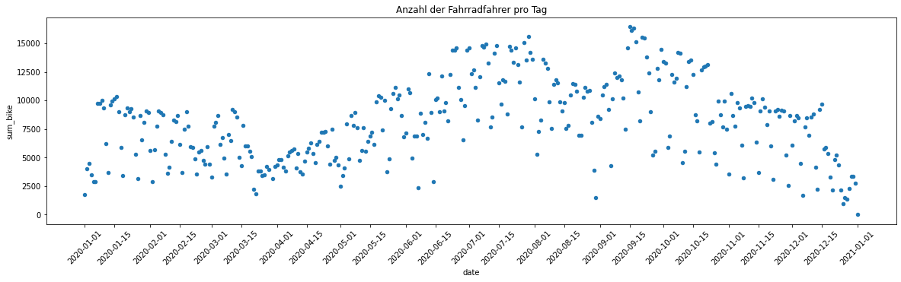
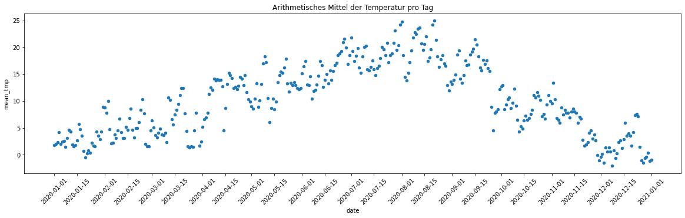

# Fahrradzähler am Herosé (2020)

Autoren: Christopher Mogler, Fabian Huonker
AIN / SoSe 2022

## Inhaltsverzeichnis

[TOC]

## Vorwort

Die Datensätze vom Fahrradzähler am Herosé, wurden von Konstanz-Open-Data bereitgestellt. Die Daten wurden als CSV Datei Heruntergeladen und mit Python, Matplotlib, Pandas, Jupyter bearbeitet. Als IDE wurde Visual Studio Code und Jupyter Notebook. Sourceverwaltung wurde Git und GitHUB verwendet. Als Markdown Editor für die Dokumente, wurde Typora eingesetzt. 

## 1. Corona und Tageszähler

> Am 17. März 2020 wurden, nach Maßgaben in der Corona-Verordnung, der  Betrieb in Kultur- und Bildungseinrichtungen jeglicher Art, Kinos,  Schwimmbädern, Sportstätten, Bibliotheken und Prostitutionsbetrieben  eingestellt. Gaststätten war der Betrieb unter strengen Auflagen weiter  erlaubt.

In der Statistik (siehe unten) sieht man, ab Mitte März und Anfang August größere Ausreißer nach unten. In dieser Zeit waren die Coronabeschränkungen aktiv.
Die Fahrradfahreranzahl ist in dieser Zeit gesunken, dass kann daran liegen das viele Zuhause geblieben sind, weil viele Restaurants und Freizeiteinrichtungen geschlossen wurden oder die Menschen auch von Zuhause aus gearbeitet haben um sich selbst zu schützen. 



## 2. Temperatur

In der Datei von "Konstanz-Open-Data" wurden die Wetterverhältnisse gespeichert. Aus den Daten haben wir das arithmetisches Mittel berechnet, pro Tag. In den unten gezeigten Graphen sieht man eine Gaußsche Normalverteilung. 

Wenn man die Beiden Graphen (oben und unten) vergleicht lässt sich eine Korrelation erkennen zwischen Temperatur und Anzahl der Fahrradfahrer. Je höher die Temperatur, desto mehr Fahrradfahrer fahren auf Konstanzs Straßen. 


## 3. Jahreszeit


In dieser empirischen Verteilerfunktion sieht man das am Anfang und am Ende die Steigung schwach ist. In der Mitte ist die Steigung am stärksten, dass kann man dadurch erklären das im Sommer die meisten Fahrradfahrer fahren. 

## 4. Kennzahlen

### Temperatur

- Median $\approx 10.0208°C$ 
- Mittelwert $\approx 10.2082°C$
- Modal  $= \{ 1.541667°C, 7.791667°C, 13.958333°C, 17.416667°C \}$
- 25%-Quantil $\approx 4.4583°C$
- 75%-Quantil $\approx 15.5729°C$

### Anzahl der Fahrradfahrer

- Median $= 8149.5$
- Mittelwert $\approx 8080.2541$
- Modal  $= \{ 9098.0 \}$
- 25%-Quantil $= 5312.75$
- 75%-Quantil $= 10207.5$

## A1. Quellcode

```python
# %%
import pandas as pd 
import matplotlib.pyplot as plt
from os.path import exists

# Dateiname der RAW-Datei
CSV_NAME = "./assets/counter_herose_2020_wetter_hour.csv"

# Lese die Daten der CSV-Datei ein
df_bicyle_csv = pd.read_csv(CSV_NAME, sep = ";")

# %%
# der Dateiname der zwischen Tabelle für Wetter-Daten
WEATHER_CSV = "./assets/df_weather.csv"

# initialisiere das DataFrame für die Wetter-Daten
df_weather = df_weather = pd.DataFrame({
    "weather": [ ],
    "sum_counter": [ ],
    "sum_bicycle": [ ]
})
# prüfe ob bereits eine Datei existiert (Zeit sparen)
if not exists(WEATHER_CSV):
    
    for row_index, row_csv in df_bicyle_csv.iterrows():
        col_weather = row_csv["Symbol Wetter"]
        col_bicycle = row_csv["FahrradbrueckeFahrradbruecke"]
        
        add = True
        for index, row_wet in df_weather.iterrows():
            wdf = row_wet["weather"]
            cnt = row_wet["sum_counter"]
            bic = row_wet["sum_bicycle"]
            
            if (col_weather == wdf):
                df_weather.loc[index] = [wdf, cnt + 1, col_bicycle + bic]
                add = False
        if add:
            df_weather.loc[len(df_weather)] = [col_weather, 1, col_bicycle]
    # print (df_weather)
    df_weather.to_csv(WEATHER_CSV)
else:
    df_weather = pd.read_csv(WEATHER_CSV)

# %%
import datetime
from datetime import datetime

# Pfad und Dateiname wo die Daten gespeichert werden sollen
TIME_CNT_CSV = "./assets/df_time_cnt.csv"

# Setzt die Indexvalues zurück
df_bicyle_csv.reset_index()

# initialisiert das pandas DataFrame für das zwischen Speichern der bearbeiten Variabeln
df_time_cnt = pd.DataFrame({ "date": [], "sum_bike": [], "mean_tmp": [], "sum_dates": [] })

# Macht aus einem String ein Date-Objekt (ohne Zeit)
def get_date(datetime_str: str):
    dt = datetime.strptime(datetime_str, "%d.%m.%Y %H:%M")
    return dt.date()

# Prüft ab ob bereits eine Datei erstellt wurde
if not exists(TIME_CNT_CSV):
    # iteriere die Zeilen der CSV Datei
    for index, row_csv in df_bicyle_csv.iterrows():
        tempC = row_csv["Temperatur (°C)"] # Temperatur von Stunde x am Tag x
        bike_cnt = row_csv["FahrradbrueckeFahrradbruecke"] # Anzahl der Fahrradfahrer von Stunde x am Tag x
        __datetime_str = row_csv["Zeit"] # Zeitstempel als String
        date_l = get_date(__datetime_str) # Datum als Date-Objekt ohne Zeit
        
        add = True 
        # iteriere die aktuelle Tabelle, um doppelte Einträge (über das Datum) zu migrieren
        for index, row_tc in df_time_cnt.iterrows():
            if row_tc["date"] == date_l:
                # Das Datum ist bereits in der Tabelle
                add = False
                # passe die Daten an
                df_time_cnt.loc[index] = [date_l, row_tc["sum_bike"] + bike_cnt, row_tc["mean_tmp"] + tempC, row_tc["sum_dates"] + 1]
        if add:
            # Es gibt keine Daten mit dem Datum, füge eine neue Zeile hinzu
            df_time_cnt.loc[len(df_time_cnt)] = [date_l, bike_cnt, tempC, 1]
    
    # Hier wird der Durchschnitt der Temperatur berechnet
    for i, row_tc in df_time_cnt.iterrows():
        # von der aktuellen Zeile
        df_time_cnt.loc[i] = [row_tc["date"], row_tc["sum_bike"], row_tc["mean_tmp"] / row_tc["sum_dates"], row_tc["sum_dates"]]
    
    # Speicher die Daten in eine csv Datei (see TIME_CNT_CSV value)
    df_time_cnt.to_csv(TIME_CNT_CSV)
else:
    df_time_cnt = pd.read_csv(TIME_CNT_CSV)
    pd.to_datetime(df_time_cnt["date"])
# print(df_time_cnt["sum_dates"][0])

# %%
xticks = []
for i, row in df_time_cnt.iterrows():
    dt = datetime.strptime(row["date"], "%Y-%m-%d")
    if dt.day == 1 or dt.day == 15:
        xticks.append(row["date"]) 

# Plotte die Korrelation zwischen Anzahl der Fahrräder und das Datum
df_time_cnt.plot(y="sum_bike", x="date", kind="scatter", figsize=(20, 5), xticks=xticks, rot=45)
plt.title("Anzahl der Fahrradfahrer pro Tag")
plt.savefig("./assets/sum_bike_I_date.png", bbox_inches='tight')

# Plotte die Korrelation zwischen der durchschnitts Temperatur und das Datum 
df_time_cnt.plot(y="mean_tmp", x="date", kind="scatter", figsize=(20, 5), xticks=xticks, rot=45)
plt.title("Arithmetisches Mittel der Temperatur pro Tag")
plt.savefig("./assets/mean_tmp_I_date.png", bbox_inches='tight')


# %%
# FÜr Anzahl der Fahrradfahrer
# berechne Median, Modalwert, Mittelwert, 75%-Quantil, 25%-Quantil
print("Anzahl der Fahrradfahrer")
print("-------------------------")
col = df_time_cnt["sum_bike"]

median = col.median()
modal = col.mode()
mean = col.mean()
q25 = col.quantile(.25)
q75 = col.quantile(.75)
print("median =", median)
print("modal =", modal)
print("mean =", mean)
print("q25 =", q25)
print("q75 =", q75)

# Für Temperatur
# berechne Median, Modalwert, Mittelwert, 75%-Quantil, 25%-Quantil
col = df_time_cnt["mean_tmp"]

print("\nTemperatur")
print("-------------------------")

median = col.median()
modal = col.mode()
mean = col.mean()
q25 = col.quantile(.25)
q75 = col.quantile(.75)
print("median =", median)
print("modal =", modal)
print("mean =", mean)
print("q25 =", q25)
print("q75 =", q75)
# %%
```


## A2. Literaturverzeichnis

- Dauerzählstellen Radverkehr | Offene Daten Konstanz (o. D.): Offene Daten Konstanz,  [online]  https://offenedaten-konstanz.de/dataset/dauerz-hlstellen-radverkehr  [abgerufen am 04.04.2022].
- Offene Daten Konstanz (o. D.): Offene Daten Konstanz, [online]  https://offenedaten-konstanz.de/dataset/dauerz-hlstellen-radverkehr/resource/c7da262a-7f4e-41a4-9a57-1d41222d77a4#{} [abgerufen am 04.04.2022].
- Wikipedia-Autoren (2020): COVID-19-Pandemie in Baden-Württemberg, Wikipedia, [online]  https://de.wikipedia.org/wiki/COVID-19-Pandemie_in_Baden-W%C3%BCrttemberg [abgerufen am 04.04.2022].
