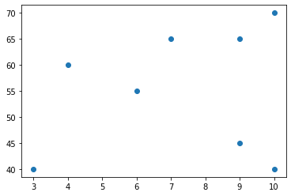
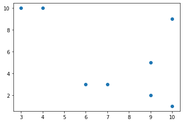
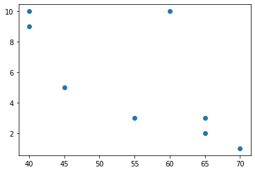

# Hausarbeit 3

Christopher R. Mogler 

[TOC]


## Aufgabe 1.11

### Aufgabe 1.11.1

| #    |                               | Lösung                                                  |
| ---- | ----------------------------- | ------------------------------------------------------- |
| a    | Modalwert                     | 9, 10                                                   |
| b    | Arithmetisches Mittel         | 7.25                                                    |
| c    | empirische Standardabweichung | 2.712405363721075                                       |
| d    | Alle Quartile                 | Q1 / 25% = 5.5<br />Q2 / 50% = 8.0<br />Q3 / 75% = 9.25 |
| e    | 60%-Quantil                   | 9.0                                                     |

```python
import pandas as pd

jobs = [
    (1, 7, 65, 3),
    (2, 4, 60, 10),
    (3, 10, 40, 9),
    (4, 10, 70, 1),
    (5, 9, 45, 5),
    (6, 3, 40, 10),
    (7, 9, 65, 2),
    (8, 6, 55, 3),
]

df_jobs = pd.DataFrame(jobs, columns=("nr", "city_appeal", "salary", "interesting"))

# 1.11.1 

city_appeal = df_jobs["city_appeal"]

# a) Modalwert
mode = city_appeal.mode()
print("a) Modalwert")
print(mode)

# b) Arithmetisches Mittel
average = city_appeal.mean()
print("\nb) Arithmetisches Mittel =", average)

# c) empirische Standardabweichung
std = city_appeal.std()
print("\nc) empirische Standardabweichung =", std)

# d) Alle Quartile
q1 = city_appeal.quantile(q=.25)
q2 = city_appeal.quantile(q=.50)
q3 = city_appeal.quantile(q=.75)
print("\nd) Alle Quartile")
print("\tQ1 / 25% =", q1)
print("\tQ2 / 50% =", q2)
print("\tQ3 / 75% =", q3)

# e) 60%-Quantil
q60 = city_appeal.quantile(q=.60)
print("\ne) 60%-Quantil =", q60)

"""OUTPUT
a) Modalwert
0     9
1    10
Name: city_appeal, dtype: int64

b) Arithmetisches Mittel = 7.25

c) empirische Standardabweichung = 2.712405363721075

d) Alle Quartile
	Q1 / 25% = 5.5
	Q2 / 50% = 8.0
	Q3 / 75% = 9.25

e) 60%-Quantil = 9.0
"""
```

### Aufgabe 1.11.2

> a) Für welchen der 8 Jobs würden Sie sich auf Basis dieser Daten entscheiden? Begründen Sie Ihre
> Meinung (es gibt keine richtige oder falsche Antwort).

Ich würde mich für Job 2 entscheiden, da zwei der drei Kriterien erfüllt sind. Gutes Geld und eine interessante Tätigkeit.

> b) Ihre Freunde Alice und Bob haben sich jeweils auch 8 Jobs ausgesucht und die Attraktivität der
> Städte ebenso mit 1-10 bewertet. Alice berechnet den Mittelwert der Städte als $ a_B = 6.875 $ und die
> entsprechende Standardabweichung zu $ s_{a_B} = 5 $. Bob berechnet den Mittelwert der Städte als $ a_C = 5 $
> und die entsprechende Standardabweichung zu $ s_{a_C} = 0 $. Was können Sie aus diesen Werten über die
> Attraktivität der Städte von Alice und Bob im Vergleich zu „ihren“ Städten sagen?

Alices Städte weichen stark vom Mittelwert ab. Sie hat fast alle Ihre Städte hoch oder niedrieg gewertet, mehr aber hoch.

Bob hat seine Städte alle gleich gewertet.

> c) Schätzen Sie die empirischen Korrelationskoeffizienten $ r_{A,G} $ , $ r_{A,I} $, $ r_{G,I} $ zwischen „Attraktivität der Stadt“
> und „Gehalt“, „Attraktivität der Stadt“ und „interessant“ sowie „Gehalt“ und „interessant“ für die aus-
> gewählten Jobs.
> Rechnen Sie diese nicht aus, sondern wählen Sie unter den folgenden Werten. Begründen Sie Ihre
> Meinung

- $ r_{A,G} $ > Attraktivität der Stadt und Gehalt
  
  Die Punkte verlaufen leicht positiv, aber sie reißen ziemlich aus, vorallem am Ende. Ich würde deshalb schätzen, dass der Wert $ r_{A,G} = 0.0093 $ beträgt.

- $ r_{A,I} $ > Attraktivität der Stadt und interessant
  
  Dadurch, dass in der Graphik die Punkte sehr verteilt sind, aber eine leichte positive Richtung annehmen, würde ich den empirischen Korrelationskoeffizienten auf $ r_{A,I} = 0.0815 $ schätzen.

- $ r_{G,I} $ > Gehalt und interessant
  
  In der Graphik oben sieht man eine negative Richtiung mit einem starken Ausreißer. Folgend komme ich auf den geschätzten Wert von $ r_{G,I} =  -0.6659 $.

```python
# ...
import matplotlib.pyplot as plt

# 1.11.2

fig, ax = plt.subplots()
ax.scatter(df_jobs["city_appeal"], df_jobs["salary"])
fig, ax = plt.subplots()
ax.scatter(df_jobs["city_appeal"], df_jobs["interesting"])
fig, ax = plt.subplots()
ax.scatter(df_jobs["salary"], df_jobs["interesting"])

"""OUTPUT
<matplotlib.collections.PathCollection at 0x7f10d0d81d30>
"""
```

## Aufgabe 2.1

### Aufgabe 2.1.1

> Betrachten Sie den Wurf eines W10 (ein Würfel mit 10 Seiten) und die Ereignisse A =ungerade Augenzahl,
> B ={2}, C ={2, 3}.

> a) Geben Sie die Ereignismenge Ω an

$$
Ω = \{1, 2, 3, 4, 5, 6, 7, 8, 9, 10\}
$$

> b) Sind A und B vereinbar? Begründen Sie Ihre Entscheidung.

Nein, da A nur aus ungeraden Zahlen besteht, es gibt also keine Zwei. Somit sind A und B nicht vereinbar.
$$
A \cap B = \emptyset
$$

> c) Sind B und C vereinbar? Begründen Sie Ihre Entscheidung

Ja, da in beiden die Zwei enthalten ist, sie sind somit vereinbar.
$$
B \cap C = \{2\}
$$

> d) Wie lauten die Gegenereignisse von A, B, C?

$$
A' = gerade\ Augenanzahl = \{2, 4, 6, 8, 10\}\\
B' = \{1, 3, 4, 5, 6, 7, 8, 9, 10\}\\
C' = \{1, 4, 5, 6, 7, 8, 9, 10\}
$$

### Aufgaben 2.1.2

> Wie groß ist die Wahrscheinlichkeit folgender Ereignisse beim Würfeln mit einem fairen W10?

> a) Augenzahl 4

$$
E_a = {4} \rightarrow |E_a| = 1\\
P(E_a) = \frac{|E_a|}{|Ω|} = \frac{1}{10} = 0.1 = 10\%
$$

> b) eine ungerade Augenzahl

$$
E_b =\{1, 3, 5, 7, 9\} \rightarrow |E_b| = 5\\
P(E_b) = \frac{|E_b|}{|Ω|} = \frac{5}{10} = 0.5 = 50\%
$$

> c) eine Augenzahl von mindestens 3

$$
E_c =\{3, 4, 5, 6, 7, 8, 9, 10\} \rightarrow |E_c| = 8\\
P(E_C) = \frac{|E_c|}{|Ω|} = \frac{8}{10} = 0.8 = 80\%
$$

> d) Augenzahl 3 oder 4

$$
E_d =\{3, 4\} \rightarrow |E_d| = 2\\
P(E_d) = \frac{|E_d|}{|Ω|} = \frac{2}{10} = 0.2 = 20\%
$$

### Aufgabe 2.1.3

> Ein fairer W10 wird zweimal geworfen. Wie groß ist die Wahrscheinlichkeit für die folgenden Ereignisse?

$$
Ω = \{(1,1),(1,2),...,(7,4),...,(10,10)\}\\
|Ω| = 100
$$

> a) zwei mal die 5

$$
E_a = \{(5, 5)\} \rightarrow |E_a| = 1\\
P(E_a) = \frac{1}{100} = 0.01 = 1\%
$$

> b) wenigstens einmal die 1

$$
E_b = \{(1, 1),(1, 2),...,(9, 1), (10, 1)\} \rightarrow |E_b| = 20\\
P(E_b) = \frac{20}{100} = 0.2 = 20\%
$$

> c) Summe der zahlen gleich 4

$$
E_c = \{(1, 3),(2, 2),(3, 1)\} \rightarrow |E_c| = 3\\
P(E_c) = \frac{3}{100} = 0.03 = 3\%
$$

> d) Summe der Zahlen größer gleich 19

$$
E_d = \{(9, 10),(10, 9),(10, 10)\} \rightarrow |E_d| = 3\\
P(E_d) = \frac{3}{100} = 0.03 = 3\%
$$

## Aufgabe 2.4

> In einer Schublade sind 6 rote und 8 blaue Socken. Bob zieht jeden morgen noch im Dunkeln zufällig zwei
> Socken aus der Schublade, um pünktlich zur Vorlesung zu kommen.
> Wie groß ist die Wahrscheinlichkeit, dass Bob
> 2 – 2

$$
|S| = |S_{rot}|\times|S_{blau}| = 6 \times 8 = 48
$$

> a) zwei rote Socken trägt?

$$
P(A) = \frac{|S_{rot}|}{|S|} = \frac{6}{48} = 0.125 = 12.5\%
$$

> b) zwei blaue Socken trägt?

$$
P(B) = \frac{|S_{blau}|}{|S|} = \frac{8}{48}\approx0.167\approx16.67\%
$$

> c) zwei verschiedene Socken trägt?

$$
P(C) = \frac{|S|-(|S_{blau}|+|S_{rot})}{|S|} = \frac{34}{48}\approx0.708\approx 70.83\%
$$

> d) zwei zueinander passende Socken trägt?

$$
P(C) = \frac{|S_{blau}|+|S_{rot}|}{|S|}=\frac{14}{48}\approx0.292\approx29.17\% 
$$

## Aufgabe 2.7

> In Entenhausen erscheinen die Lokalblätter „Abendzeitung“ und „Bildpost“. Wir betrachten die Ereignisse
> • A : ein Einwohner von Entenhausen liest die Abendzeitung,
> • B : ein Einwohner von Entenhausen liest die Bildpost.
> Die Wahrscheinlichkeit, dass ein Einwohner
> • die Abendzeitung liest sei 0.6
> • die Bildpost liest, sei 0.5
> • die Abendzeitung oder die Bildpost (oder beide) liest, sei 0.9.
> Stellen Sie die gesuchten Ereignisse mit Hilfe der Ereignisse A und B dar und berechnen Sie die Wahrscheinlichkeiten, dass ein Einwohner

$$
U = Urmenge\\
P(U) = 1.0\\
P(A) = 0.6\\
P(B) = 0.5\\
P(A\cup B) = 0.9
$$

> a) beide Lokalblätter liest,

$$
P(A\cap B) = 0.9-(0.9-0.6)-(0.9-0.5)=0.2
$$

> b) keines der beiden Lokalblätter liest,

$$
P(U \setminus A\cup B) = 1.0 - 0.9 = 0.1
$$

> c) ein Lokalblatt, aber nicht beide liest?

$$
A\bigtriangleup B := (A\setminus B)\cup(B\setminus A)\\
P(A\bigtriangleup B) = (0.9 - 0.6) + (0.9 - 0.5) = 0.7
$$

## Aufgabe 2.3

> Einige Banken errechnen Karten-PINs anhand der Kontonummer des Kunden. Nach einigen Rechenschritten wird am Ende eine vierstellige PIN aus den Ziffern 0-9 erzeugt.

### Aufgabe 2.3.1

>Wie viele solcher PINs gibt es,

> a) wenn jede Ziffer mehrfach vorkommen darf?

$$
A:=P^W(10,4)=10^4=10\ 000
$$

> b) wenn jede Ziffer mehrfach vorkommen darf und die erste Stelle keine Null sein darf?

$$
B:=P^W(9,1)\times P^W(10,3)=9\times 10^3=9\ 000
$$


### Aufgabe 2.3.2

> Mit welcher Wahrscheinlichkeit findet ein:e Angreifer:in in höchstens drei Versuchen in denen eine zufällig Zahl geraten wird (dumme:r Angreifer:in, der/die evtl. eine Zahl auch mehrmals wählt), die richtige PIN heraus,

> a) wenn jede Ziffer mehrfach vorkommen darf?

$$
P(A) = \frac{3}{A}=0.0003=0.03\%
$$

> b) wenn jede Ziffer mehrfach vorkommen darf und die erste Stelle keine Null sein darf?

$$
P(B) = \frac{3}{B}=0.000\overline{333}=0.0\overline{333}\%
$$

## Aufgabe 2.12

Die Aufgabe wurde von Christopher R. Mogler bearbeitet

>Sie möchten demonstrieren, wie unsicher ein System ist, welches nur Passwörter zulässt, die genau 5 Zeichen lang. Die verwendbaren Zeichen sind lateinische (unsere üblichen) Klein- und Großbuchstaben (ohne Umlaute) und Ziffern von 0-9 die sich beliebig wiederholen dürfen.

> a) Berechnen Sie, wie viele unterschiedlichen Passwörter mit dieser Struktur es gibt.

$$
E = 10+26+26 = 62\\
P(E,5)=916\ 132\ 832
$$

>b) Versuchen Sie anschließend, ein Passwort zu knacken, welches nach genau diesem Schema aufgebaut ist. Der von http://www.sha1-online.com/berechnet SHA1 Hash des Passworts ist
>
>39228d06a988045c5caaa97bf0a6158893d51862
>Wie lautet das Passwort?

Das Passwort ist `S0nN3` 

> c) Geben Sie an, wie lange Ihr Programm gelaufen ist.

Das Program hat das Passwort in `434.2671899796` Sekunden gefunden.

### PC Spezifikationen

Prozessor:	 AMD® Ryzen 7 2700x eight-core processor × 16 
RAM: 			15,6 GiB
Mainboard:	Gigabyte Technology Co., Ltd. X470 AORUS GAMING 7 WIFI
OS:				Ubuntu 21.10 - 64bit

### Quellcode

> Quick and dirty :stuck_out_tongue:

```python
import hashlib # hashlib für das Hashen der Kombinationen
import time # Time um die Dauer der Anwendung zu erhalten

# Das gesuchte Passwort
pw = "39228d06a988045c5caaa97bf0a6158893d51862"

# Die Methode, um das Passwort zu finden.
def get_password(list_combination) -> str:
    count = 0
    # Durchlauf vom ersten Zeichen
    for a in list_combination:
        # Durchlauf vom zweiten Zeichen
        for b in list_combination:
            # Durchlauf vom dritten Zeichen
            for c in list_combination:
                # Durchlauf vom vierten Zeichen
                for d in list_combination:
                    # Durchlauf vom fünften Zeichen
                    for e in list_combination:
                        count += 1 # Zähler hochsetzen
                        word = bytes(a + b + c + d + e, 'utf-8') # die Kombination in UTF-8 Bytes konvertieren
                        hex = hashlib.sha1(word).hexdigest() # die Konbination in SHA1 hashen
                        if count % 10000000 == 0:
                            # nach 10M Kombinationen einen Zwischenstand abgeben
                            print(count / 1000000, "M")
                            print(word, " das aktuelle Wort")
                        if str(hex) == str(pw):
                            # wenn die Kombination als Hash genau gleich ist, wie vom angegebenen (gehashten) Passwort 
                            print("Nach ", count, " Iterationen wurde das Passwort gefunden!")
                            return word # Abbruch der Iteration und gebe die gefunde Kombination zurück 
    return None # Wenn kein Passwort gefunden wurde, gebe None zurück

if __name__ == "__main__": 
    # Geht in die Schleife, wenn die Python-Datei der aktuelle Hauptprozess ist
    try:
        # Alle möglichen Zahlen als Liste
        list_digits = [str(i) for i in range(10)]
        # Alle möglichen Großbuchstaben
        list_upper = ["A", "B", "C", "D", "E", "F", "G", "H", "I", "J", "K", "L", "M", "N", "O", "P", "Q", "R", "S", "T", "U", "V", "W", "X", "Y", "Z"]
        # Alle mögliche Kleinbuchstaben
        list_lower = [str(UpChar).lower() for UpChar in list_upper]

        # Kombiniere alle Möglichkeiten in einer Liste
        list_all = list_digits + list_upper + list_lower

        # aktueller Zeitstempel am Startpunkt (in Sekunden)
        start = time.time()
        # Führe die Methode aus, um das Passwort zu finden 
        word = get_password(list_all)
        # aktueller Zeitstempel am Endpunkt (in Sekunden)
        end = time.time()
        if (word is None):
            # Wenn keine Kombination gefunden wurde
            print("Es wurde kein Passwort gefunden!")
        else:
            # Wenn das Passwort gefunden wurde
            # Gebe die Dauer der Anwendung zurück
            #       - Die Dauer wird berechnet aus dem End-Zeitstempel minus dem Start-Zeitstempel
            print("Das Passwort wurde in {} Sekunden gefunden.".format(round(end-start, 10)) ) 
            # Gebe das gefundene Passwort zurück
            print("Das Passwort lautet =", word)

    except Exception as e:
        # Sollt es zu einer Exception kommen,
        # gebe diese in der Konsole zurück
        print(e)

# ANWENDUNG WIRD HIER BEENDET

"""OUTPUT
...
...
410 M
b'RkJjD'  das aktuelle Wort
Nach  413927194  Iterationen wurde das Passwort gefunden!
Das Passwort wurde in 434.2671899796 Sekunden gefunden.
Das Passwort lautet = b'S0nN3'
"""
```


