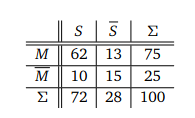

# Hausarbeit 4

Christopher Mogler

## Aufgabe 3.1

### Aufgabe 3.1.1

> Wir betrachten eine Klausur zur Stochastik. Die Verteilung der Studierenden auf die Noten 1, 2, 3, 4 und
> 5 beträgt 8, 16, 32, 24 bzw. 20 %.
> Wie groß ist die Wahrscheinlichkeit, dass ein zufällig ausgewählter Studierender mindestens die Note 2
> erzielt hat?

$$
16 + 8 = 24\\
\frac{24}{100} = 0.24 = 24\%
$$

### Aufgabe 3.1.2

>Im letzten Semester haben alle Studierenden des 2. Semesters sowohl an der Klausur Stochastik als auch an
>der Klausur Mathematik 2 teilgenommen. In der nachstehenden Vierfeldertafel sind die Ereignisse S ( Sto-
>chastik bestanden), M (Mathematik 2 bestanden), S ( Stochastik nicht bestanden) und M (Mathematik 2
>nicht bestanden) sowie die möglichen Kombinationen aus den Ereignissen mit ihren relativen Häufigkeiten
>in % angegeben.

> Wie groß ist die Wahrscheinlichkeit, dass ein zufällig ausgewählter Studierender aus dem 2. Semester

> a) die Stochastik Klausur bestanden hat, wenn er die Mathematik 2 Klausur bestanden hat?

$$
\frac{62}{75} \approx 0.827 \approx 82.7 \%
$$

> b) die Mathematik 2 Klausur bestanden hat, wenn er die Stochastik Klausur bestanden hat?

$$
\frac{62}{72} \approx 0.861 \approx 86.1 \%
$$

> c) die Mathematik 2 Klausur nicht bestanden hat, wenn er die Stochastik Klausur bestanden hat?

$$
\frac{10}{72} \approx 0.139 \approx 13.9 \% 
$$

## Aufgabe 3.2

### Aufgabe 3.2.1

> Alice sucht in zwei großen, verschiedenen, voneinander unabhängigen Kisten nach einer Lampe mit genau
> 10 Watt. Die eine Kiste enthält LED-Lampen, die andere Energiesparlampen. Alice weiß, dass die Wahr-
> scheinlichkeit, eine LED-Lampe mit 10 Watt zu finden bei P(L) = 20% liegt, die Wahrscheinlichkeiten
> dafür, eine Energiesparlampe mit 10 Watt zu finden bei P(E) = 40%.
> Alice zieht aus jeder Kiste genau eine zufällig ausgewählte Lampe (also insgesamt eine LED-Lampe und
> eine Energiesparlampe). Wie groß ist die Wahrscheinlichkeit, dass sie mindestens eine Lampe (egal welcher
> Bauart) mit genau 10 Watt gefunden hat?

$$
P'(L) = 100\% - 20\% = 80\% = 0.8\\
P'(E) = 100\% - 40\% = 60\% = 0.6\\
P(EL) = 1 - 0.8 *0.6 = 0.52 = 52\%
$$

### Aufgabe 3.2.2

> Bob hat auf seinem Schreibtische einen Karton, in dem sich 5 Glühbirnen, darunter 2 defekte befinden,
> stehen. Bob wählt nun eine Glühbirne nach der anderen zufällig aus, prüft diese auf Funktionalität, protokolliert das Ergebnis und legt die gezogene bei Seite. Er wiederholt den Prozess, bis die beiden defekten
> Glühbirnen gefunden sind.

> a) Mit welcher Wahrscheinlichkeit zieht Bob im ersten Versuch eine defekte Glühbirne?

$$
\frac{2}{5} = 0.4 = 40\%
$$

> b) Mit welcher Wahrscheinlichkeit zieht Bob im zweiten Versuch eine defekte Glühbirne? (Verwenden
> Sie eine Fallunterscheidung!) 

$$
\frac{3}{5} \times \frac{2}{4} + \frac{2}{5} \times \frac{1}{4} = 0.4 = 40\%
$$

>c) Mit welcher Wahrscheinlichkeit hat Bob erst nach der dritten Ziehung die beiden defekten Glühbirnen
>gefunden?
>Nutzen Sie einen Ereignisbaum, um das Experiment zu modellieren! 

$$
P(Erfolg\ 3\ Versuch) = \frac{2}{5} \times \frac{3}{4} \times \frac{1}{3} + \frac{3}{5} \times \frac{2}{4} \times \frac{1}{3} = \frac{1}{5} = 0.2 = 20\%
$$

## Aufgabe 3.3

>Eine Bank hat herausgefunden, dass sich Ihre Kundschaft in die Kategorien Chaoten, Normalos und Streber
>unterteilen lässt. Die Wahrscheinlichkeit, dass ein Angehöriger jeder Gruppe seine Kreditkarte verliert sind
>wie folgt:
>• Streber: Die Wahrscheinlichkeit des Kredikartenverlusts beträgt 1.5%
>• Normalos: Die Wahrscheinlichkeit des Kredikartenverlusts beträgt 3%
>• Chaoten: Die Wahrscheinlichkeit des Kredikartenverlusts beträgt 5.5%
>Die Bank weiß weiter, dass 20 % der Kunden Streber sind, 50 % der Kunden sind Normalos.

>a) Modellieren Sie das Szenario mithilfe der Ereignisse
>• V : Ein Kunde verliert die Kreditkarte
>• S, T, C: Ein Kunde gehört zur Gruppe der Streber, Normalos oder Chaoten.
>und leiten Sie deren entsprechenden Wahrscheinlichkeiten aus dem Text ab.

$$
P(S) = 20 * 1.5\% = 0.3\% = 0.003\\
P(T) = 50 * 3\% = 1.5\% = 0.015 \\
P(C) = 30 * 5.5\% = 1.65\% = 0.0165\\
$$

>b) Wie groß ist die Wahrscheinlichkeit, dass ein Kunde (egal aus welcher Gruppe) seine Kreditkarte
>verliert?

$$
0.003 + 0.015 + 0.0165 = 0.0345 = 3.45\%
$$

>c) Ein Kunde meldet den Verlust seiner Kreditkarte. Geben Sie (unter dieser Bedingung) die Wahrscheinlichkeit dafür an, dass der Kunde

- ein Streber	
  $$
  P(S|V) = \frac{0.003}{0.0345} \approx 0.08696 \approx 8.696\%
  $$

- Normalo
  $$
  P(T|V) = \frac{0.015}{0.0345} \approx 0.43478 \approx 43.478 \%
  $$

- ein Chaot
  $$
  P(C|V) = \frac{0.0165}{0.0345} \approx 0.47826 \approx 47.826 \%
  $$

ist.

## Aufgabe 3.5

> In einem Restaurant bestellen gewöhnlich 40% der Gäste keine Vorspeise und 30% der Gäste keinen Nach-
> tisch. 15% der Gäste nehmen weder Vorspeise noch Nachtisch.
> Verwenden Sie geeignete Ereignisse, um alle aus dem Text ableitbaren Wahrscheinlichkeiten anzugeben.
> Beantworten Sie dann folgende Fragen: 
>
> Hinweis: Es könnte hilfreich sein, zum Modellieren der gegebenen Wahrscheinlichkeiten eine Vierfelder-
> tafel zu verwenden.

|        | N    | !N   |      |
| ------ | ---- | ---- | ---- |
| **V**  | 0.45 | 0.15 | 0.6  |
| **!V** | 0.25 | 0.15 | 0.4  |
|        | 0.7  | 0.3  | 1.0  |

> a) Wie groß ist die Wahrscheinlichkeit, dass ein Gast keine Nachspeise nimmt, unter der Bedingung, dass er auch keine Vorspeise genommen hat?

$$
P(!N|!V) = P(!V\cap!N) / P(!V) = 0.15 / 0.4 = 0.37 = 37\%
$$

> b) Wie groß ist die Wahrscheinlichkeit, dass ein Gast, der eine Vorspeise gewählt hat, auch noch einen Nachtisch bestellt?

$$
P(N|V) = P(V\cap N) / P(V) = 0.45/0.6 = 0.75 = 75\%
$$

## Aufgabe 3.7

### Aufgabe 3.7.1

> Zehn befreundete heterosexuelle binäre Paare (jeweils Mann & Frau) setzten sich in eine Reihe, die 20
> Plätze umfasst. Wie viele mögliche Sitzordnungen gibt es, wenn

$$
|Paare| = 5 \rightarrow |Frauen| = 5 \rightarrow |Männer| = 5
$$

> a) sich die Personen beliebig setzen können (N1 ),

$$
P(20) = 20! \approx 2,4329×10^{18}
$$

> b) die Partner jeweils nebeneinander sitzen (N2 ),

$$
P(N2) = (10!)^2 \approx  1,3168×10^{13}
$$

> c) die Frauen alle nebeneinander sitzen (N3)? (Achtung: schwer!)

$$
P(N3) = 10 \times P(N2) = 10 \times (10!)^2 = 1,3168×10^{14}
$$

### Aufgabe 3.7.2

> Die Vorstellung „Der Besuch der alten Dame“ wird von Erwachsenen und Jugendlichen besucht. 60% der
> Erwachsenen und 20% der Jugendlichen kaufen ein Programmheft.
>
> Hinweis: Verwenden Sie einen Wahrscheinlichkeitsbaum.

$$
P(E) = ?\\
P(P|E) = 0.6\\
P(P'|E) = 0.4\\\\
P(J) = ?\\
P(P|J) = 0.2\\
P(P'|J) = 0.8
$$

> a) Wie groß ist der Anteil der Jugendlichen unter den Besuchern, wenn 40% aller Besucher ein Pro-
> grammheft kaufen?

$$
\frac{0.2}{0.4} = 0.5 = 50\%
$$

> b) Mit welcher Wahrscheinlichkeit ist ein zufällig ausgewählter Käufer eines Programmheftes ein Jugendlicher?

$$
P(J|P) = P(J\cap P)/P(P) = 0.5 \times 0.2 / (0.5 \times 0.2 + 0.5 \times 0.6) = 0.25 = 25\%
$$

## Aufgabe 3.8

> Wir betrachten eine fiktive Grenze zur Schweiz, die nur von Autos aus Großbritannien, Frankreich und
> Deutschland passiert wird. Die Wahrscheinlichkeit, dass ein britisches Auto über die Grenze fährt, ist 10%,
> die Wahrscheinlichkeit, dass ein deutsches Auto über die Grenze fährt, ist 70%.
> Die Zöllner an dieser Grenze wissen, dass ein britisches Auto mit einer Wahrscheinlichkeit von 40% Schwarz-
> geld schmuggelt, ein deutsches Auto mit einer Wahrscheinlichkeit von 50% und ein französisches Auto mit
> einer Wahrscheinlichkeit von 30%.
> Hinweis: Verwenden Sie zur Modellierung die folgenden Ereignisse (und die jeweiligen Gegenereignisse):
> • GB, F, D : ein Auto kommt aus Großbritannien, Frankreich, Deutschland
> • S : ein Auto schmuggelt Schwarzgeld.

>a) Modellieren Sie das beschriebene Szenario z.B. durch einen Wahrscheinlichkeitsbaum oder mit Hilfe
>einer Stichpunktliste. Geben Sie alle aus dem Text ableitbaren Wahrscheinlichkeiten der beschriebe-
>nen Ereignisse an.

|      | P(S\|GB) | P(S'\|GB) | P(S\|F) | P(S'\|F) | P(S\|D) | P(S'\|D) |
| ---- | -------- | --------- | ------- | -------- | ------- | -------- |
|      | 0.4      | 0.6       | 0.3     | 0.7      | 0.5     | 0.5      |
| 100% | 0.04     | 0.06      | 0.06    | 0.14     | 0.35    | 0.35     |

> b) Wie groß ist die Wahrscheinlichkeit, dass ein zufällig ausgewähltes Auto (beliebiger Nationalität)
> Schwarzgeld schmuggelt?

$$
0.04+0.06+0.35 = 0.45 = 45\%
$$

> c) Wie groß ist die Wahrscheinlichkeit, dass ein Auto das kein Schwarzgeld schmuggelt, aus Großbritannien ist?

$$
0.06/(0.06+0.14+0.35) \approx 0.10\overline{9999} \approx 10.\overline{9999}\%
$$

> d) Wie groß ist die Wahrscheinlichkeit, dass ein Auto das Schwarzgeld schmuggelt, aus Deutschland
> ist?

$$
0.35/(0.04+0.06+0.35) \approx 0.\overline{777} \approx 77.\overline{77} \%
$$

