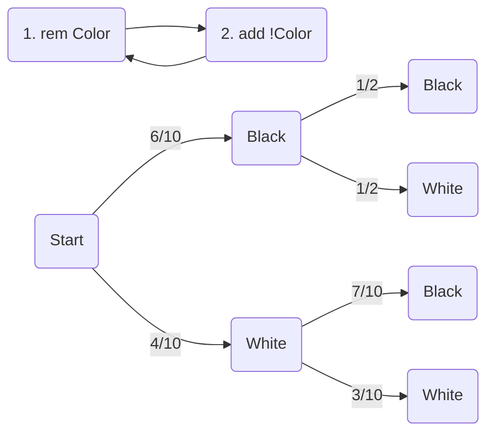
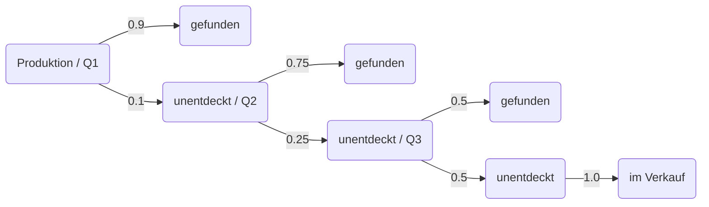
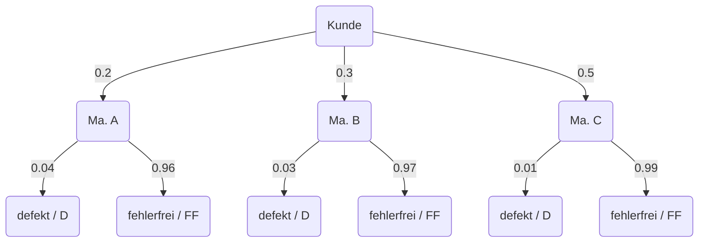
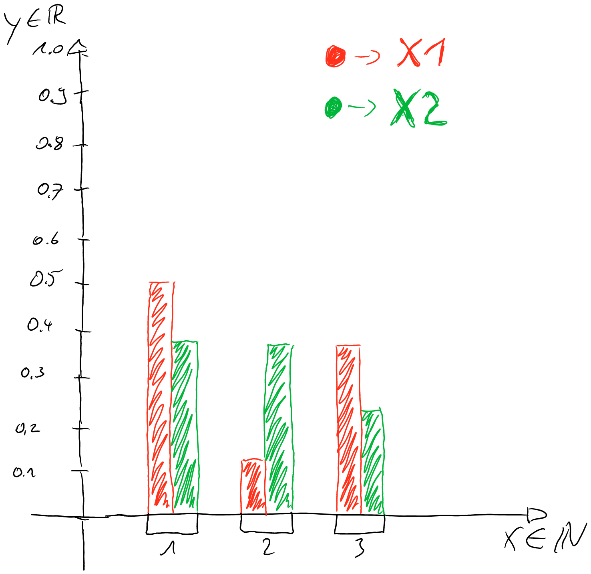
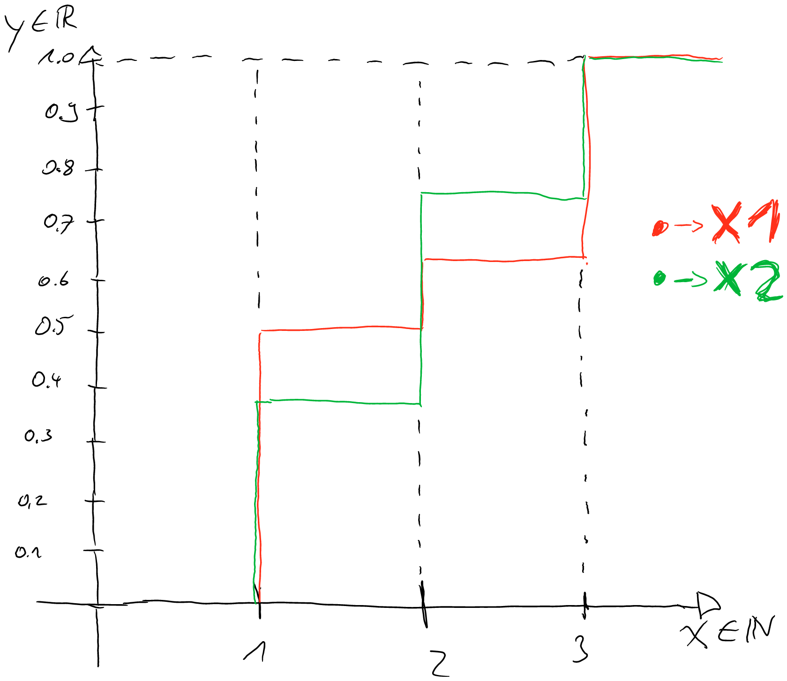
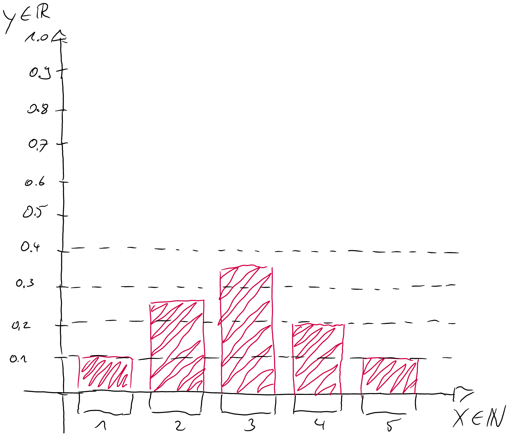
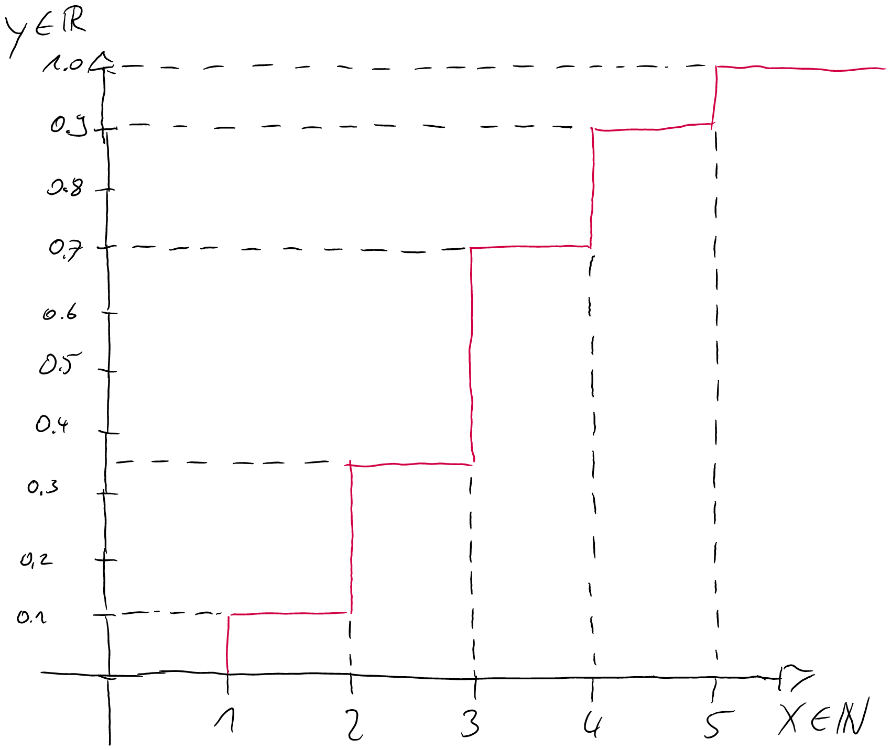
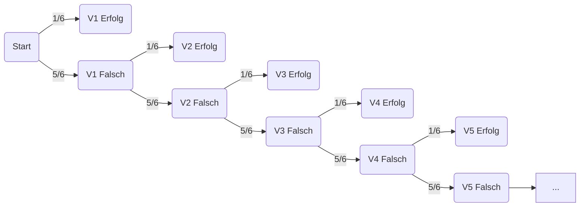

# Hausarbeit 5

Christopher R. Mogler

## Inhaltsverzeichnis

[TOC]

## 3.6 EINE SPEZIELLE URNE

> In einer Urne befinden sich 4 weiße (W) und 6 schwarze (S) Kugeln. Eine Kugel wird zufällig entnommen
> und dafür eine der anderen Farbe wieder hineingelegt. Dann wird der Urne eine weitere Kugel entnommen.
>
> Bestimmen Sie mit Hilfe des Ereignisbaumes die Wahrscheinlichkeit, dass

> c) die zuletzt gezogene Kugel weiß ist

$$
P(LW) = \frac{6}{10} \times \frac{1}{2} + \frac{4}{10} \times \frac{3}{10} = 0.42 = 42\% \quad (L = last, W = white)
$$

> b) man bei beiden Ziehungen jeweils Kugeln gleicher Farbe erhält

$$
P(B) = \frac{6}{10} \times \frac{1}{2} = 0.3 = 30\% \quad (B = black)\\
P(W) = \frac{4}{10} \times \frac{3}{10} = 0.12 = 12\% \quad (W = white)
$$

> c) beide Kugeln weiß sind, wenn bekannt ist, dass die gezogenen Kugeln die gleiche Farbe haben

$$
P(E) = P(B) + P(W) = 0.42 = 42\% \quad (E = equals)\\
P(E|W) = P(E) \times P(W) = 0.0504 = 5.04\% \quad (W = white)
$$

## 3.9 QUALITÄTSKONTROLLE I

> Eine Maschine zur Herstellung von USB-Sticks produziert nicht fehlerfrei. Es werden daher drei Qualitäts-
> kontrollen hintereinander geschaltet, um die fehlerhaften Sticks auszusondern. Bei der ersten Kontrolle
> werden 90 %, bei der zweiten Kontrolle werden 75 % und bei der dritten Kontrolle werden 50 % der
> jeweils noch vorhandenen defekten USB-Sticks entdeckt und entfernt.

>a) Wie groß ist die Wahrscheinlichkeit, dass ein fehlerhafter USB-Stick jeweils bei der ersten, zweiten
>oder dritten Kontrolle entdeckt wird?
>Hinweis: Verwenden Sie bedingte Wahrscheinlichkeiten und einen mehrstufigen Wahrscheinlich-
>keitsbaum zur Modellierung des Szenarios.

$$
P(Q1) = 0.9 = 90\%\\
P(Q2) = 0.1 \times 0.75 = \frac{3}{40} = 7.5\%\\
P(Q3) = 0.1 \times 0.25 \times 0.5 = \frac{1}{80} = 1.25\%
$$

>b) Wie groß ist die Wahrscheinlichkeit, dass ein fehlerhafter USB-Stick die Fabrik verlässt, ohne dass er
>bei einer Kontrolle entdeckt wird?

(V) => Verkauf
$$
P(V) = P(Q3) = 1.25\%
$$

## 3.11 QUALITÄTSKONTROLLE II

> Ein Zulieferer produziert ein Bauteil X auf den drei Maschinen A, B und C, die mit Ausschussquoten von 4,
> 3 bzw. 1 % arbeiten. Bei einer Lieferung an einen seiner Kunden stammen 20 % der Bauteile von Maschine
> A, 30 % von B und 50 % von C.

> a) Verwenden Sie zur Modellierung die folgenden Ereignisse:
>
> A, B, C : Bauteil kommt von Maschine A,B,C
> D : defektes Bauteil, F F : fehlerfreies Bauteil
>
> Geben Sie (so möglich) für diese Ereignisse, sowie die aus dem Text direkt ableitbaren bedingten
> Ereignisse die Wahrscheinlichkeiten an!

$$
P(A) = 0.2 = 20\%\\
P(B) = 0.3 = 30\%\\
P(C) = 0.5 = 50\%\\
P(D) = 0.2 \times 0.04 + 0.3 \times 0.03 + 0.5 \times 0.01 = \frac{11}{500} = 0.022 = 2.2\%\\
P(FF) = 1 - P(D) = 97.8\%
$$

> b) Der Kunde akzeptiert Lieferungen mit einer Ausschussquote von maximal 2 %. Würde die maximale
> Ausschussquote in der Lieferung überschritten, falls keine Endkontrolle durchgeführt würde? (Berechnen Sie also die Wahrscheinlichkeit, dass ein Bauteil defekt ist

Wie oben in der Aufgabe "a" berechnet, liegt die Wahrscheinlichkeit, dass ein Bauteil defekt ist bei 2.2%. 
Darum ist die Fehlerquote um 0.2 % zu hoch für den Kunden, wenn die Produktion wirklich keine QS am Ende macht.

>c) Wie groß ist die Wahrscheinlichkeit, dass ein Bauteil von Maschine B stammt, wenn es bei der Endkontrolle als defekt eingestuft wurde?

$$
P(D|B) = \frac{0.3 \times 0.03}{0.022} = \frac{9}{22} \approx 0.4\overline{09}
$$

## 4.1 GLÜCKSOKTAEDER

>Wir besuchen das Casino „Glückauf“. Dort gibt es zwei Typen von Laplace-Oktaedern (Würfeln mit 8 Seiten,
>deren Seiten jeweils mit gleicher Wahrscheinlichkeit gewürfelt werden):
>
>• Typ1 ist beschriftet mit den Ziffern 1, 1, 1, 1, 2, 3, 3, 3
>• Typ2 ist beschriftet mit den Ziffern 1, 1, 1, 2, 2, 2, 3, 3
>
>Für ein Spiel wird mit je einem Oktaeder vom Typ1 und einem Oktaeder vom Typ2 gewürfelt. Wir definieren
>die folgenden Zufallsvariablen:
>
>• X1 bildet ab auf die Zahl, die der Oktaeder vom Typ1 zeigt,
>• X2 bildet ab auf die Zahl, die der Oktaeder vom Typ2 zeigt.

### 4.1.1 TEILAUFGABE

>a) Geben Sie für beide Zufallsvariablen jeweils die (Wahrscheinlichkeits)verteilung und die Verteilungsfunktion an.

$$
P_{X1}(X) = \begin{cases} 
\frac{4}{8} & für\ X = 1\\ 
\frac{1}{8} & für\ X = 2\\
\frac{3}{8} & für\ X = 3\\
0 & sonst
\end{cases}\\
P_{X2}(X) = \begin{cases} 
\frac{3}{8} & für\ 0 < X < 3\\
\frac{2}{8} & für\ X = 3\\
0 & sonst
\end{cases}
$$

>b) Stellen Sie in einem Diagramm die (Wahrscheinlichkeits)verteilungen von X1 und X2 dar.

>c) Stellen Sie in einem Diagramm die Verteilungsfunktion von X1 und X2 dar.

### 4.1.2  TEILAUFGABE

> a) Berechnen Sie für X1 und X2 jeweils den Erwartungswert.

$$
E_{X1}(X) = (4 \times 1 + 2 + 3 \times 3) \times \frac{1}{8} = \frac{15}{8}\\
E_{X2}(X) = (3 \times 1 + 3 \times 2 + 2 \times 3) \times \frac{1}{8} = \frac{15}{8}
$$

> b) Berechnen Sie für X1 und X2 jeweils die Varianz.

$$
VAR(X1) = (1-\frac{15}{8})^2\times\frac{4}{8} + (2-\frac{15}{8})^2 \times \frac{1}{8} + (3-\frac{15}{8})^2 \times \frac{3}{8} = \frac{55}{64} = 0.859375\\
VAR(X2) = (1-\frac{15}{8})^2\times\frac{3}{8} + (2-\frac{15}{8})^2 \times \frac{3}{8} + (3-\frac{15}{8})^2 \times \frac{2}{8} = \frac{39}{64} = 0.609375
$$

> c) Berechnen Sie für X1 und X2 jeweils die Standardabweichung.

$$
σ_{X1}  = \sqrt{VAR(X1)} = \frac{\sqrt{55}}{8} \approx 0.92705\\
σ_{X2}  = \sqrt{VAR(X2)} = \frac{\sqrt{39}}{8} \approx 0.78062
$$

## 4.2 AUFGABE

> Betrachten Sie die Zufallsvariable X , welche folgende Wahrscheinlichkeitsverteilung hat:
>
> | X            | 1    | 2    | 3    | 4    | 5    |
> | ------------ | ---- | ---- | ---- | ---- | ---- |
> | $ P(X = x) $ | 0.1  | 0.25 | 0.35 | 0.2  | 0.1  |

>a) Zeichnen Sie ein Diagramm der (Wahrscheinlichkeits)verteilung.

>b) Zeichnen Sie ein Diagramm der Verteilungsfunktion.

>c) Berechnen Sie E(X )

$$
E(X) = 1 \times \frac{1}{10} + 2 \times \frac{1}{4} + 3 \times \frac{7}{20} + 4 \times \frac{1}{5} + 5 \times \frac{1}{10} = \frac{59}{20} = 2.95
$$

>d) Berechnen Sie Var(X )

$$
VAR(X) = (1 \times \frac{59}{20})^2 \times \frac{1}{10} + (2 \times \frac{59}{20})^2 \times \frac{1}{4} + (3 \times \frac{59}{20})^2 \times \frac{7}{20} + (4 \times \frac{59}{20})^2 \times \frac{1}{5} + (5 \times \frac{59}{20})^2 \times \frac{1}{10}\\ = 86.589875
$$

## 4.3 WÜRFELN BIS DIE 1 KOMMT

>Im Casino „Glückauf“ kann man auch „normalen“ Würfeln spielen. Hierfür wird mit einem fairen Laplace
>W6 folgendes Spiel gespielt: Der Würfel wird so lange geworfen, bis eine 1 fällt, höchstens jedoch 5 Mal.
>Die Zufallsvariable X gibt die Anzahl der hierfür nötigen Würfe an.
>Beispiele: Für die Würfelfolge (5, 6, 3, 1) gilt X = 4, für (4, 1) gilt X = 2, für (5, 6, 3, 3, 2) gilt X = 5, ebenso
>wie für (5, 4, 3, 2, 1).

### 4.3.1 TEILAUFGABE

>a) Geben Sie (andeutungsweise) den Ereignisraum Ω des Experiments an.

$$
\Omega_X = \{(1),(2),(3),..., (1,1),(1,2),(1,3), ..., (5,6,6,6,6),(6,6,6,6)\}
$$

>b) Geben Sie den Träger (= Wertebereich) von X an.

$$
W_X=[0;5]\in \mathbb{N} = \{0,1,2,3,4,5\}
$$

### 4.3.2 TEILAUFGABE

>a) Bestimmen Sie die Wahrscheinlichkeitsverteilung von X

$$
P(X) = \frac{1}{6}
$$

>b) Bestimmen Sie die Verteilungsfunktion von X

$$
P(X) = \begin{cases} 
\frac{1}{6} & für\ 0 < X \leqslant 6\\
0 & sonst
\end{cases}
$$

### 4.3.3 TEILAUFGABE

>a) Berechnen Sie die Wahrscheinlichkeit, dass genau 2 mal gewürfelt werden muss.

$$
P_2(1) = (1 - P(X)) \times P(X) = \frac{5}{6} \times \frac{1}{6} = \frac{5}{36} \approx 0.13\overline{888}
$$

>b) Berechnen Sie die Wahrscheinlichkeit, dass höchstens 5 mal gewürfelt werden muss.

$$
P_5(X) = \frac{1}{6}+\sum_{i=1}^5\left[\left(\frac{5}{6}\right)^i\times\frac{1}{6}\right] \approx 0.6651
$$

>c) Berechnen Sie die Wahrscheinlichkeit, dass mindestens 3 mal gewürfelt werden muss.

$$
P_3(X) = \frac{1}{6}+\sum_{i=1}^3\left[\left(\frac{5}{6}\right)^i\times\frac{1}{6}\right] = \frac{671}{1296} \approx 0.5177
$$

>d) Berechnen Sie die Wahrscheinlichkeit, dass mehr als 4 mal gewürfelt werden muss.

$$
P_4(X) = \left(\frac{5}{6}\right)^4 = \frac{625}{1296} \approx 0.48225
$$

