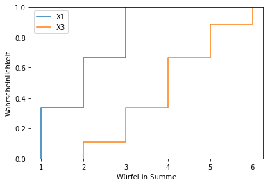

# Hausarbeit 6

Christopher R. Jäger

## 4.8 EIN SPEZIELLES WÜRFELSPIEL

> Alice und Bob spielen ein Glücksspiel. Hierzu verwenden Sie zwei gleichartige spezielle, faire 6-seitige Würfel, mit denen gleichzeitig gewürfelt wird. Die verwendeten Würfel sind jeweils mit den Ziffern 1, 1, 2, 2, 3, 3
> beschriftet.
> Betrachten Sie die folgenden Zufallsvariablen:
> • $X_1$, die Augenzahl, die Würfel 1 zeigt
> • $X_2$, die Augenzahl, die Würfel 2 zeigt
> • $X_3 = X_1 + X_2$, die Zahl, die durch die Addition der Augenzahlen der beiden Würfeln entsteht.

### 4.8.1 TEILAUFGABE

>a) Geben Sie für $X_1$ und $X_3$ jeweils die Wahrscheinlichkeitsverteilung an (z.B. in einer gemeinsamen
>Tabelle).

$$
P_1(X)=\begin{cases}
\frac{1}{3}& für\ 0 < X < 4 | X \in \mathbb{N}\\
0& sonst
\end{cases}
\\
\\
P_3(X)=\begin{cases}
\frac{1}{9}& für\ x \in \{2,6\}\\
\frac{2}{9}& für\ x \in \{3,5\}\\
\frac{1}{3}& für\ x = 4\\
0& sonst
\end{cases}
$$

>b) Stellen Sie in einem gemeinsamen Diagramm die Wahrscheinlichkeitsverteilunsfunktion von $X_1$ und
>$X_3$ dar. Achten Sie auf korrekte Beschriftungen. Ihr Diagramm muss nicht exakt sein, soll aber den Unterschied zwischen den Verteilungsfunktionen klar machen.



```python
# Python Script für 4.8.1
import matplotlib.pyplot as plt
import numpy as np
import seaborn as sns

fig, ax = plt.subplots()

x1 = [1,1,2,2,3,3]
x3 = [2,3,3,4,4,4,5,5,6]

sns.ecdfplot(data=x1)
sns.ecdfplot(data=x3)
ax.set_xticks(np.arange(1, 7))
ax.legend(['X1', 'X3'])
plt.xlabel("Würfel in Summe")
plt.ylabel("Wahrscheinlichkeit")
plt.show()
```

>c) Alice gewinnt, falls Würfel 1 ein Zahl größer als 1 zeigt, Bob gewinnt, falls die Summe der Augenzahlen der Würfel höchsten 4 ist. Ist dieses Spiel fair? (Anmerkung: Ein Spiel ist fair, wenn alle Spieler
>die gleiche Chance haben, zu gewinnen.)

**Alice**
$$
X_1 = \{2,3\}\\
P_A = \frac{1}{3} + \frac{1}{3} = \frac{2}{3}
$$
**Bob**
$$
X_3 = 2, 3, 3, 4, 4, 4 \\
P_B = \frac{1}{9} + \frac{2}{9} + \frac{1}{3} = \frac{2}{3}
$$

**Antwort**
Ja, das Spiel ist fair. Beide haben die gleiche Chance zu gewinnen.

### 4.8.2 TEILAUFGABE

> a) Berechnen Sie den Erwartungswert von $X_1$

$$
E(X_1) = (2\times1 + 2\times2 + 2\times3)\times6^{-1}=2
$$

> b) Berechnen Sie die Varianz von $X_1$

$$
VAR(X_1)=(1-2)^2\times\frac{1}{3}+(2-2)^2\times\frac{1}{3}+(3-2)^2\times\frac{1}{3} = \frac{2}{3} \approx 0.\overline{666}
$$

> c) Berechnen Sie die Standardabweichung von $X_1$

$$
o=\sqrt{VAR(X_1)}=\sqrt{\frac{2}{3}}\approx0.8165
$$

> d) Berechnen Sie für $X_3$ Erwartungswert und die Varianz mit Hilfe Ihrer Berechnungen für $X_1$.

$$
E(X_3) = E(X_1) \times 2 = 4\\
VAR(X_3) = VAR(X_1) \times 2 = \frac{4}{3} \approx 1.\overline{333}
$$

## 5.1

> Ein 10-seitiger fairer Würfel (W10) wird 5 mal geworfen. Wir betrachten die Zufallsvariablen X =Anzahl
> der geworfenen Einsen.
>
> a) Überlegen Sie sich, wie X verteilt ist. Geben Sie dann den Ereignisraum des Zufallsexperimentes (andeutungsweise), sowie den Wertebereich von X an.

$$
\Omega = \{(1,1,1,1,1), (1,1,1,1,2), ..., (10,10,10,10,9), (10,10,10,10,10)\}\\
W_X = [0;5] = \{0, 1, 2, 3, 4, 5\}
$$

> b) Geben Sie die gesamte Wahrscheinlichkeitsverteilung von X an (konkret also für jeden Wert, den X
> annehmen kann, dessen Wahrscheinlichkeit).

$$
P(X) = \begin{cases}
\binom{5}{0} \times \frac{1}{10}^0 \times \frac{9}{10}^5 = \frac{
59049}{100000}& für\ X = 0\\
\binom{5}{1} \times \frac{1}{10}^1 \times \frac{9}{10}^4 = \frac{
6561}{20000}& für\ X = 1\\
\binom{5}{2} \times \frac{1}{10}^2 \times \frac{9}{10}^3 = \frac{729}{10000}& für\ X = 2\\
\binom{5}{3} \times \frac{1}{10}^3 \times \frac{9}{10}^2 = \frac{81}{10000}& für\ X = 3\\
\binom{5}{4} \times \frac{1}{10}^4 \times \frac{9}{10}^1 = \frac{9}{20000}& für\ X = 4\\
\binom{5}{5} \times \frac{1}{10}^5 \times \frac{9}{10}^0 = \frac{1}{100000}& für\ X = 5\\
0 & sonst
\end{cases}
$$

> c) Berechnen Sie die Wahrscheinlichkeiten folgender Ereignisse:
>
> • in 5 Würfen höchstens zwei Einsen zu haben

$$
\binom{5}{0} \times \frac{1}{10}^0 \times \frac{9}{10}^5 + 
\binom{5}{1} \times \frac{1}{10}^1 \times \frac{9}{10}^4 + 
\binom{5}{2} \times \frac{1}{10}^2 \times \frac{9}{10}^3 = \frac{12393}{12500}
$$

> • in 5 Würfen mindestens drei Einsen zu haben

$$
\binom{5}{3} \times \frac{1}{10}^3 \times \frac{9}{10}^2 + 
\binom{5}{4} \times \frac{1}{10}^4 \times \frac{9}{10}^1 + 
\binom{5}{5} \times \frac{1}{10}^5 \times \frac{9}{10}^0 = \frac{107}{12500}
$$

> d) Wie viele Einsen kann man bei 5 Würfen des W10 auf lange Sicht erwarten (Geben Sie den Erwartungswert an)?

$$
\frac{1}{10}\sum_{i=1}^{10}i = \frac{11}{2} = 5.5
$$

## 5.2

>Sie lesen in einer Zeitung, dass es am Gardasee im August durchschnittlich an 8 Tagen regnet. Sie möchten das Wetter am Gardasee im Jahr 2022 simulieren und nehmen an, dass jeder Tag des Augusts in Ihrer Simulation die gleiche Regenwahrscheinlichkeit hat (die Sie aus der Zeitungsaussage ableiten).
>Betrachten Sie die Zufallsvariablen
>
>- R: ist gleich 1, falls der 8.8.2022 am Gardasee ein Regentag ist, 0 sonst
>- A: Anzahl der Tag im August 2022 , die am Gardasee verregnet sind
>- W : Anzahl der Tage, die man am Gardasee ab dem 1.8.2022 bis zum ersten Regentag warten werden muss
>
>a) Geben Sie an wie und mit welchen Parametern die Zufallsvariablen R, A, W jeweils verteilt sind.

$$
R = Bin\left(1, \frac{8}{31}\right)\\
A = Bin\left(31, \frac{8}{31}\right)\\
W = Geom\left(\frac{8}{31}\right)
$$

>b) Mit welcher Wahrscheinlichkeit wird es im August 2022 am Gardasee mehr als 3 Regentage geben?

$$
P(x > 3) \approx 0.9754
$$

```python
from scipy.stats import binom
t = binom.cdf(3, 31, 8 / 31)
```

>c) Was ist (auf lange Sicht, beobachtet über mehrere Jahre) der Erwartungswert der Anzahl der Tage,
>die man ab dem 1. August auf Regen warten werden muss?

$$
P(X = 1) = 1\times\frac{31}{8} = 3.875
$$

## 5.3

> Ein Software-Hersteller hat für seine Kunden eine Hotline eingerichtet. An Werktagen rufen zwischen 20.00
> und 21.00 Uhr durchschnittlich 5 Kunden an. Man nimmt an, dass die Anzahl der Anrufe pro Stunde poissonsverteilt ist. Die Hotline ist so besetzt, dass sie in dieser Zeit 4 Anrufe entgegennehmen kann.
>
> a) Wie groß ist die Wahrscheinlichkeit, dass zwischen 20 und 21 Uhr genau 3 Kunden anrufen?

$$
P(X=3) \approx 0.140374
$$

```python	
from scipy.stats import poisson
t = poisson.pmf(3, 5)
```

> b) Wie groß ist die Wahrscheinlichkeit, dass die Hotline überlastet ist?

$$
P(X>4) \approx 0.559507
$$

```python
from scipy.stats import poisson
t = 1 - poisson.cdf(4, 5)
```

## 5.11

