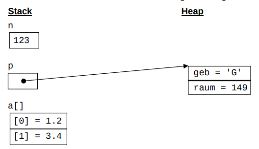

# Klausurvorbereitung Systemprogrammierung für AIN/2

2022 &copy; Christopher JÄGER

## Aufgabe 1

[Lösung für Aufgabe 1](./part_1/)

Übersetzen Sie das folgenden aus zwei Klassen bestehende Java-Programm
in ein C-Programm mit zwei Übersetzungseinheiten:

```java
public final class Gruss {
    private Gruss() { }
    
    private static final String GRUSS_FORMAT = "%s %s!%n";
    
    public static void ausgeben(String vorname) {
        if (vorname.equals("Sepp")) {
            System.out.printf(GRUSS_FORMAT, "Servus", vorname); 
        } else {
            System.out.printf(GRUSS_FORMAT, "Hallo", vorname);
        }
    }
}

public final class GrussTest {
    private GrussTest() { }
    
    public static void main(String[] args) {
        System.out.print("Bitte Vorname eingeben: ");
        String vorname = new java.util.Scanner(System.in).next();
        Gruss.ausgeben(vorname);
    }
}
```

## Aufgabe 2

[Lösung für Aufgabe 2](./part_2)

Schreiben Sie ein Makefile, dass alle Quelldateien Ihres C-Programms aus Aufgabe 1 in ein Archiv aufgabe1.tar.gz verpackt. Halten Sie sich dabei an die besprochenen Stilregeln.

## Aufgabe 3

[Lösung für Aufgabe 3](./part_3)

Erstellen Sie mit C-Definitionen und -Anweisungen die folgende Hauptspeicherbelegung:



## Aufgabe 4

[Lösung für Aufgabe 4](./part_4)

Schreiben Sie ein C-Programm summe, das beliebig viele ganze Zahlen als Kommandozeilenargumente erwartet und die Summe dieser Zahlen ausgibt. Verwenden Sie dabei die Bibliotheksfunktion atoi oder strtol.

Beispiel: summe 123 456 # gibt 579 aus

## Aufgabe 5

[Lösung für Aufgabe 5](./part_5)

Stellen Sie die Belegung der main-Parameter argc und argv für den Beispiel Programmaufruf aus Aufgabe 4 graphisch im Stil von Aufgabe 3 dar

## Aufgabe 6

[Lösung für Aufgabe 6](./part_6)

Schreiben Sie das Java-Programm aus Aufgabe 1 als C++-Programm mit zwei Übersetzungseinheiten.

