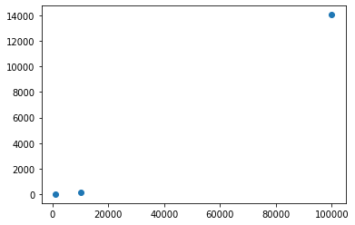

# Aufgabe 02

## Changelog

- [Aufgabe 02 > Bonus > Woher kommt der Laufzeitunterschied?](#Woher kommt der Laufzeitunterschied?)
- [Aufgabe 02 > Laufzeitmessung > Q&A > * Anpassungen](#Q&A)

## Inhaltsverzeichnis

[TOC]


## Migration von Java nach C: Bubblesort

### Protokoll
```
mogler@mogler-pc:~/repos/HTWG/sysprog/src/aufgabe02$ javac Bubblesort.java 
mogler@mogler-pc:~/repos/HTWG/sysprog/src/aufgabe02$ java Bubblesort 10
Bitte 10 ganze Zahlen eingeben: 10 23 532 324912 12321

-206323170
-290606298
-26311655
-1146482434
-1594377662
Sortierte Zahlenfolge: 
-1594377662
-1146482434
-290606298
-206323170
-26311655
10
23
532
12321
324912
mogler@mogler-pc:~/repos/HTWG/sysprog/src/aufgabe02$ make bubblesort
gcc -g -Wall -Wextra -Werror -Wvla -std=c11 -pedantic    bubblesort.c   -o bubblesort
mogler@mogler-pc:~/repos/HTWG/sysprog/src/aufgabe02$ ./bubblesort 10
Bitte 10 ganze Zahlen eingeben:
10
23
532
324912
12321

Sortierte Zahlenfolge:
10
23
532
12321
324912
1181045438
1602367766
1700236952
1879619161
1983208997
mogler@mogler-pc:~/repos/HTWG/sysprog/src/aufgabe02$ valgrind ./bubblesort 10
==28496== Memcheck, a memory error detector
==28496== Copyright (C) 2002-2017, and GNU GPL'd, by Julian Seward et al.
==28496== Using Valgrind-3.17.0 and LibVEX; rerun with -h for copyright info
==28496== Command: ./bubblesort 10
==28496== 
Bitte 10 ganze Zahlen eingeben:
10
23
532
324912
12321

Sortierte Zahlenfolge:
10
23
532
12321
324912
697610515
735922064
736171835
778149397
1233522196
==28496== 
==28496== HEAP SUMMARY:
==28496==     in use at exit: 0 bytes in 0 blocks
==28496==   total heap usage: 9 allocs, 9 frees, 2,184 bytes allocated
==28496== 
==28496== All heap blocks were freed -- no leaks are possible
==28496== 
==28496== For lists of detected and suppressed errors, rerun with: -s
==28496== ERROR SUMMARY: 0 errors from 0 contexts (suppressed: 0 from 0)
mogler@mogler-pc:~/repos/HTWG/sysprog/src/aufgabe02$ make cppcheck
cppcheck --enable=warning,style --std=c11 bubblesort.c
Checking bubblesort.c ...
mogler@mogler-pc:~/repos/HTWG/sysprog/src/aufgabe02$
```

## Automatisierter Test
> Was gibt die obige Befehlsfolge im Terminal aus, wenn Ihr bubblesort richtig sortiert hat?

Nichts

### Protokoll

```
mogler@mogler-pc:~/repos/HTWG/sysprog/src/aufgabe02$ ./bubblesort 1000 < /dev/null | tail -1000 > out.txt
mogler@mogler-pc:~/repos/HTWG/sysprog/src/aufgabe02$ sort -n out.txt | diff - out.txt
mogler@mogler-pc:~/repos/HTWG/sysprog/src/aufgabe02$ 
```

## Laufzeitmessung

### Q&A

> Wächst die Ausführungszeit tatsächlich quadratisch mit der Array-Größe?



Ja

> Ist das Java-Programm oder das C-Programm schneller? Können Sie sich den Unterschied erklären?

Bei kleineren Größen ist ganzklar C schneller. Das hat den Hintergrund, das C sofort ausgeführt wird, weil es für den Rechner kompiliert ist. Während Java noch seine VM "hochfährt" und das Programm interpretierten muss.

Bei größeren Arrays ist Java vergleichsweise schnell.
Das hat den Hintergrund, dass HS- / JIT-Compiler während der Laufzeit den Maschinencode optimieren.

> Ist das optimierte Programm erkennbar schneller?

- vs. Java? Ja, sehr deutlich. Selbst bei 100.000 Integer.
- vs. Unoptimized C? Ja, aber nur bei größer Anzahl von Einträgen.

### Protokolle

#### Java Bubblesort

```
mogler@mogler-pc:~/repos/HTWG/sysprog/src/aufgabe02$ time java Bubblesort 1000 < /dev/null > /dev/null

real    0m0,111s
user    0m0,102s
sys     0m0,029s
mogler@mogler-pc:~/repos/HTWG/sysprog/src/aufgabe02$ time java Bubblesort 10000 < /dev/null > /dev/null

real    0m0,223s
user    0m0,366s
sys     0m0,062s
mogler@mogler-pc:~/repos/HTWG/sysprog/src/aufgabe02$ time java Bubblesort 100000 < /dev/null > /dev/null

real    0m14,055s
user    0m14,301s
sys     0m0,052s
mogler@mogler-pc:~/repos/HTWG/sysprog/src/aufgabe02$
```

#### C Bubblesort

```
mogler@mogler-pc:~/repos/HTWG/sysprog/src/aufgabe02$ time ./bubblesort 1000 < /dev/null > /dev/null

real    0m0,005s
user    0m0,004s
sys     0m0,000s
mogler@mogler-pc:~/repos/HTWG/sysprog/src/aufgabe02$ time ./bubblesort 10000 < /dev/null > /dev/null

real    0m0,219s
user    0m0,219s
sys     0m0,000s
mogler@mogler-pc:~/repos/HTWG/sysprog/src/aufgabe02$ time ./bubblesort 100000 < /dev/null > /dev/null

real    0m23,874s
user    0m23,873s
sys     0m0,000s
mogler@mogler-pc:~/repos/HTWG/sysprog/src/aufgabe02$
```

#### C Bubblesort + Optimierungsoption

```
mogler@mogler-pc:~/repos/HTWG/sysprog/src/aufgabe02$ make "CC=gcc -g -O2" clean all
rm -f bubblesort bubblesort.o
gcc -g -O2 -Wall -Wextra -Werror -Wvla -std=c11 -pedantic    bubblesort.c   -o bubblesort
mogler@mogler-pc:~/repos/HTWG/sysprog/src/aufgabe02$ time ./bubblesort 1000 < /dev/null > /dev/null

real    0m0,003s
user    0m0,003s
sys     0m0,000s
mogler@mogler-pc:~/repos/HTWG/sysprog/src/aufgabe02$ time ./bubblesort 10000 < /dev/null > /dev/null

real    0m0,115s
user    0m0,115s
sys     0m0,000s
mogler@mogler-pc:~/repos/HTWG/sysprog/src/aufgabe02$ time ./bubblesort 100000 < /dev/null > /dev/null

real    0m12,812s
user    0m12,812s
sys     0m0,000s
mogler@mogler-pc:~/repos/HTWG/sysprog/src/aufgabe02$ 
```

## Bonus

### Execution Time

> Welche der beiden Schleifen ist bei sehr großem `n` schneller?

**a[i] = r;**

```c
for (int i = 0; i < n; ++i)
{
    int r = rand() % n;
    a[i] = r;
}
```

> Erklären Sie, wie der Laufzeitunterschied zwischen den beiden Schleifen zustande kommt. Sie brauchen für die Antwort Kenntnisse über Rechnerarchtekturen. Der entscheidende Begriff fängt mit dem Buchstaben C an.

### Woher kommt der Laufzeitunterschied?

Das Beispiel mit dem `a[i] = r` ist schneller, da der Compiler das `i` im Code Segment speichert und daher nicht wie bei der Variable `r`  aus dem "HEAP" laden muss. Dadurch werden Ausführschritte gespart. 

**a[r] = r in MIPS**

```c
for (int i = 0; i < n; ++i)
{
    int r = rand() % n;
    a[r] = r;
}
```

```assembly
# C Code in MIPS Kompiliert (MIPS GCC 11.2.0)
# ...
		li      $17,983040              # 0xf0000
        addiu   $17,$17,16960
$L2:
        jal     rand
        nop
        bne     $17,$0,1f
        div     $0,$2,$17
        break   7
        mfhi    $2
# START ------ a[r] = r;
        sll     $3,$2,2		# $3 = $2 << 2
        addu    $3,$18,$3	# $3 = $18 + $3
# END -------- a[r] = r;
        addiu   $16,$16,-1
        bne     $16,$0,$L2
        sw      $2,0($3)	#  a[r] = r;
# ....
```

**a[i] = r in MIPS**

```c
for (int i = 0; i < n; ++i)
{
	int r = rand() % n;
    a[i] = r;
}
```

```assembly
# C Code in MIPS Kompiliert (MIPS GCC 11.2.0)
# ...
        move    $16,$2
        li      $3,3997696              # 0x3d0000
        addiu   $3,$3,2304
        addu    $18,$2,$3
        li      $17,983040              # 0xf0000
        addiu   $17,$17,16960
$L2:
        jal     rand
        nop
        bne     $17,$0,1f
        div     $0,$2,$17
        break   7
        mfhi    $2
# START ---- a[i] = r;
        sw      $2,0($16)
# END ------ a[i] = r;
        addiu   $16,$16,4
        bne     $16,$18,$L2
        move    $2,$0
# ....
```

Der Code wurde mit der Seite [GodBlot.org](https://godbolt.org/) und dem MIPS GCC 11.2.0 Compiler kompiliert.

### Protokoll

```
mogler@mogler-pc:~/repos/HTWG/sysprog/src/aufgabe02/bonus$ make clean
rm -f bonus bonus.o
mogler@mogler-pc:~/repos/HTWG/sysprog/src/aufgabe02/bonus$ make bonus
gcc -g -Wall -Wextra -Werror -Wvla -std=c11 -pedantic    bonus.c   -o bonus
mogler@mogler-pc:~/repos/HTWG/sysprog/src/aufgabe02/bonus$ make cppcheck
cppcheck --enable=warning,style --std=c11 bonus.c
Checking bonus.c ...
mogler@mogler-pc:~/repos/HTWG/sysprog/src/aufgabe02/bonus$ valgrind ./bonus 0 10000
==37810== Memcheck, a memory error detector
==37810== Copyright (C) 2002-2017, and GNU GPL'd, by Julian Seward et al.
==37810== Using Valgrind-3.17.0 and LibVEX; rerun with -h for copyright info
==37810== Command: ./bonus 0 10000
==37810== 
a[r] = r==37810== 
==37810== HEAP SUMMARY:
==37810==     in use at exit: 0 bytes in 0 blocks
==37810==   total heap usage: 2 allocs, 2 frees, 41,024 bytes allocated
==37810== 
==37810== All heap blocks were freed -- no leaks are possible
==37810== 
==37810== For lists of detected and suppressed errors, rerun with: -s
==37810== ERROR SUMMARY: 0 errors from 0 contexts (suppressed: 0 from 0)
mogler@mogler-pc:~/repos/HTWG/sysprog/src/aufgabe02/bonus$ valgrind ./bonus 1 10000
==37697== Memcheck, a memory error detector
==37697== Copyright (C) 2002-2017, and GNU GPL'd, by Julian Seward et al.
==37697== Using Valgrind-3.17.0 and LibVEX; rerun with -h for copyright info
==37697== Command: ./bonus 1 10000
==37697== 
a[i] = r==37697== 
==37697== HEAP SUMMARY:
==37697==     in use at exit: 0 bytes in 0 blocks
==37697==   total heap usage: 2 allocs, 2 frees, 41,024 bytes allocated
==37697== 
==37697== All heap blocks were freed -- no leaks are possible
==37697== 
==37697== For lists of detected and suppressed errors, rerun with: -s
==37697== ERROR SUMMARY: 0 errors from 0 contexts (suppressed: 0 from 0)
mogler@mogler-pc:~/repos/HTWG/sysprog/src/aufgabe02/bonus$ time ./bonus 0 10000000
a[r] = r
real	0m0,394s
user	0m0,381s
sys	0m0,012s
mogler@mogler-pc:~/repos/HTWG/sysprog/src/aufgabe02/bonus$ time ./bonus 1 10000000
a[i] = r
real	0m0,178s
user	0m0,165s
sys	0m0,012s
mogler@mogler-pc:~/repos/HTWG/sysprog/src/aufgabe02/bonus$
```

